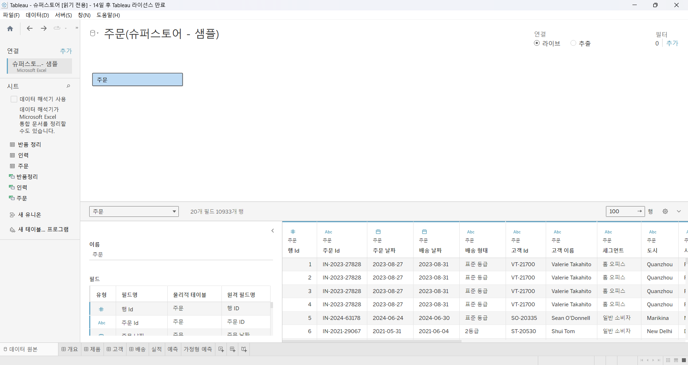
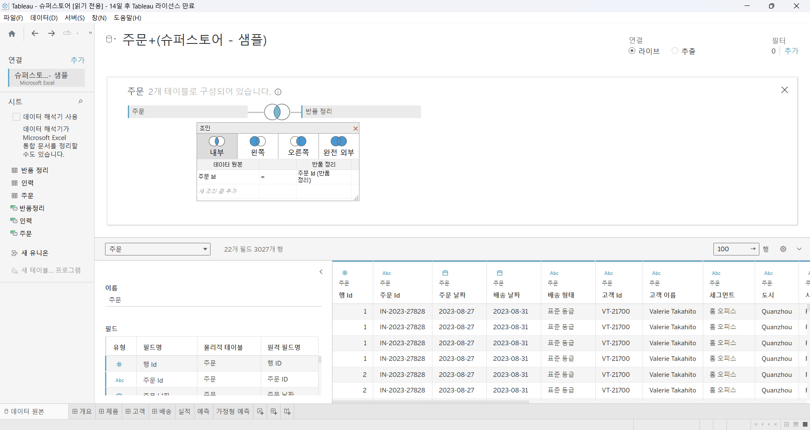
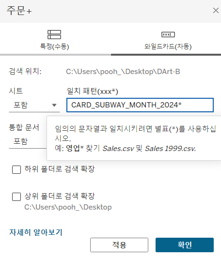

# First Study Week

- 1강: [태블로설치](#1강-태블로설치)

- 2강: [데이터연결](#2강-데이터연결)

- 3강: [데이터연결과 데이터유형](#3강-데이터연결과-데이터유형)

- 4강: [데이터결합과 관계](#4강-데이터결합과-관계)

- 5강 : [데이터결합과 조인](#5-데이터결합과-조인)

- 6강: [데이터결합 혼합](#6강-데이터결합-혼합)

- 7강: [데이터결합과 유니온](#7강-데이터-결합과-유니온)

- 8강: [라이브 및 추출](#8강-라이브-및-추출)

- 9강: [데이터형식](#9강-데이터형식)

- 문제1 : [문제1](#문제-1)

- 문제2 : [문제2](#문제-2)

- 참고자료 : [참고자료](#참고-자료)


## Study Schedule

| 강의 범위     | 강의 이수 여부 | 링크                                                                                                        |
|--------------|---------|-----------------------------------------------------------------------------------------------------------|
| 1~9강        |  ✅      | [링크](https://youtu.be/3ovkUe-TP1w?si=CRjj99Qm300unSWt)       |
| 10~19강      | 🍽️      | [링크](https://www.youtube.com/watch?v=AXkaUrJs-Ko&list=PL87tgIIryGsa5vdz6MsaOEF8PK-YqK3fz&index=75)       |
| 20~29강      | 🍽️      | [링크](https://www.youtube.com/watch?v=AXkaUrJs-Ko&list=PL87tgIIryGsa5vdz6MsaOEF8PK-YqK3fz&index=65)       |
| 30~39강      | 🍽️      | [링크](https://www.youtube.com/watch?v=e6J0Ljd6h44&list=PL87tgIIryGsa5vdz6MsaOEF8PK-YqK3fz&index=55)       |
| 40~49강      | 🍽️      | [링크](https://www.youtube.com/watch?v=AXkaUrJs-Ko&list=PL87tgIIryGsa5vdz6MsaOEF8PK-YqK3fz&index=45)       |
| 50~59강      | 🍽️      | [링크](https://www.youtube.com/watch?v=AXkaUrJs-Ko&list=PL87tgIIryGsa5vdz6MsaOEF8PK-YqK3fz&index=35)       |
| 60~69강      | 🍽️      | [링크](https://www.youtube.com/watch?v=AXkaUrJs-Ko&list=PL87tgIIryGsa5vdz6MsaOEF8PK-YqK3fz&index=25)       |
| 70~79강      | 🍽️      | [링크](https://www.youtube.com/watch?v=AXkaUrJs-Ko&list=PL87tgIIryGsa5vdz6MsaOEF8PK-YqK3fz&index=15)       |
| 80~89강      | 🍽️      | [링크](https://www.youtube.com/watch?v=AXkaUrJs-Ko&list=PL87tgIIryGsa5vdz6MsaOEF8PK-YqK3fz&index=5)        |


<!-- 여기까진 그대로 둬 주세요-->


## 1강. 태블로설치

**데이터 원본 작업 공간**

```
: 실제로 시각화 이루어지는 곳 X
: 시각화 이전에 데이터 전처리, 시각화 된 파일을 저장하는 방법을 설정하는 워크스페이스
```
<!-- 태블로 Desktop은 유료 혹은 사용자 인증이 되어야 하므로, 사용 경험이 없으시다면 우선 Tableau Public으로 학습하는 것을 권장드립니다. -->


## 2강. 태블로연결


> **🧞‍♀️ 데이터 해석기는 어떤 경우 사용하나요?**

```
-  병합된 셀, 메모, 바닥글, 빈 셀등을 감지해서, 그것들을 포함하지 않은 데이터 집합의 실제 필드와 값을 식별할 수 있게 하는 기능

-> 즉, 태블로를 읽기 쉽도록 데이터를 관리하는 경우에 사용
```


> **🧞‍♀️ 깃허브 assignment 폴더의 DArt-B Sample Store.xls 파일을 다운받고 시트 중 '주문' 시트를 불러와주세요.**



<!-- 캡쳐 파일을 첨부해주세요! 캡쳐하는 법은 깃허브 강의 영상에 있습니다 (폴더 생성 후 폴더 안에 이미지 넣기 + 불러오기) -->


<!-- 문제와 문제 풀이가 모두 위 DArt-B Sample Store.xls 파일을 기반으로 제시되므로, 해당 엑셀파일을 사용하셔야 혼동이 없습니다. -->


## 3강. 데이터연결과 데이터 유형


> **🧞‍♀️ 라이브와 추출의 차이가 무엇인가요? 어떤 경우 사용하나요?**


```
[라이브]
:태블로가 데이터에 직접 연결하는 형태
-> 데이터 원본의 변화가 있으면 시트에서 작업한 내용에 바로 영향 有
-> 데이터 양이 많아지면 처리속도 및 성능 저하

[추출]
:hyper형식의 파일을 저장해야 시각화 작업을 할 수 있는 창으로 넘어감
-크거나 복잡한 데이터 집합에 대해 빠른 데이터 수집 및 분석쿼리 처리가 가능
-현재 데이터 원본의 상태를 hyper형태로 저장하는 것
-> 오프라인상황에서도 추출파일을 갖고 있으면 작업이 가능
-> 라이브에 비해 처리속도 빠름
-> 변경된 경우, 새로 고침을 통해 추출데이터를 최신화할 수 있음. 

*hyper:태블로의 새로운 인메모리 데이터 엔진 기술

=> 사용하고자 하는 데이터 원본의 저장위치 및 데이터 크기, 혹은 온·오프라인 환경등을 고려해서 연결방식을 선택할 것. 

```


## 4강. 데이터결합과 관계

<!-- 데이터 결합과 관계에 대해 알게 된 점을 자유로이 적어보세요.-->

- 관계: 원본 데이터를 보다 독립적으로 활용할 수 있음

- 루트테이블을 삭제하면 관련된 하위테이블이 모두 삭제 됨 

    => 테이블 모델링의 순서에 유의해야함.


> **🧞‍♀️ 어떤 경우에 관계를, 어떤 경우에 조인을 사용하나요?**

```
[관계]
: Tableau에서 권장하는 연결방식

<조건>
결합하려는 데이터 간의 유형이 동일해야함.

조건 예시)
A [ a,b,c ]
B [ c,d,e ]
두 테이블(A,B) 의 C가 같은 필드값을 갖고 있어야 함.

<특징>
** 필드가 고유값이 아니면 데이터가 중복해서 들어갈 수 있음

** 데이터를 독립적으로 활용할 수 있음
-> 원래 테이블의 세부 수준을 유지할 수 있음

** 조인의 문제 보완 (데이터 중복 및 필터링 문제 방지) 

-----------------------------------

[조인]
: 제어 혹은 의도적인 필터링, 복제를 위한 경우 조인으로 결합하는 경우가 있음

<방법>
- 테이블의 물리적 계층을 열어야함
(필드에 있는 테이블을 더블클릭 OR 오른쪽 마우스 열기버튼)
-join은 테이블의 유형이 같아야만 가능

<유형>

- inner join : 두 테이블 모두 일치하는 값만 포함
* 테이블 간 값이 일치하지 않으면 삭제됨.

- left / right join : 한쪽 테이블의 모든 값과 반대쪽 테이블의 한쪽 테이블과 일치하는 항목만 포함
* 일치하는 값이 없는 경우 null 로 표시

- outer join : 두 테이블의 모든 값을 완전히 포함하는 테이블 생성
*일치하지 않아도 null로 표시
```


## 5강. 데이터결합과 조인

<!-- 데이터 결합과 조인에 대해 알게 된 점을 적고, 아래 질문에 답해보세요 :) -->

주문 중 '반품된' 주문만을 가지고 분석을 진행하려고 합니다.

> **🧞‍♀️ 해당 목적 달성을 위해서 Sample store 데이터셋의 어떤 시트를 조인(혹은 릴레이션)해야 할까요? 조인키는 무엇인지, (inner, outer, left, right) 조인 유형은 무엇일지 논의해주세요.**

```
전체 주문 데이터 중에서도 반품된 주문을 확인하고 싶은 것이기에 주문 테이블과 반품 테이블에서 일치하는 데이터값(주문 & 반품테이블의 교집합)만 알아보기 위해 INNER JOIN을 선택함.

조인키 : 고유값인 주문 ID를 기준으로 조인을 진행
```


데이터를 조인한 데이터 원본 창의 캡쳐를 첨부해주세요.
몇 개의 주문이 반품되었다고 표시되나요?




```
조인한 결과 총 3027개의 데이터가 일치하는 것으로, 반품된 주문의 수는 3027개임을 확인할 수 있다.
```

## 6강. 데이터결합 혼합

<!-- 데이터결합 및 혼합에 대해 알게 된 점을 적어주세요 -->

```
데이터결합이란?
:데이터 원본을 독립적으로 결과를 집계한 후 한 시트에서 데이터를 시각화 할 수 있도록 하는 방법임.

데이터를 실제로 결합하진않음
즉, 혼합된 결과만을 화면에 나타내는 것.

(혼합은 권장하지 않고 있음)
```


## 7강. 데이터 결합과 유니온

<!-- 유니온에 대해 알게 된 점을 적어주세요 -->

> **🧞‍♀️ 유니온을 사용하기 위한 전제 조건은 무엇인가요?**
```
[유니온]
:한 테이블의 행을 다른 테이블에 추가해서 결합하는 방법

<조건>
: 데이터의 테이블 구조가 동일해야 함
- 각 테이블의 필드 수가 같고,
- 관련 필드의 필드 이름과 데이터 유형이 일치해야 함.

<방법>
1) 새 유니온 > 결합하고자 하는 테이블 추가
2) 필드 추가 후, 위치 조정

<여러 필드를 한 번에 유니온 하고 싶은 경우>
테이블 오른쪽 마우스 클릭 > 유니온 편집 > 와일드카드 선택 후 조건입력
```


## 8강. 라이브와 추출

<!-- 라이브와 추출에 대해 알게 된 점을 적어주세요 -->

> **🧞‍♀️ 라이브와 추출 방법의 차이가 무엇인가요? 어떤 경우에 추출을 사용하면 좋을까요?**

```
성능에서의 차이 有

라이브 - 데이터 원본의 변경사항이 Tableau에 실시간으로 반영됨
        원본 데이터가 변경 될때, DB의 기본데이터를 쿼리함
        사전 처리를 위해 Tableau 서버에 데이터가 복사되지 않음
        DB에서 모든 과정이 처리 됨 -> DB의 성능에 따라 속도가 달라짐
        EX) 병원에서 실시간으로 환자의 상황을 체크하는 경우


추출 - 원본 데이터에서 업데이트를 추출하려면 매번 새로고침해야함
        일정 시간마다 데이터가 새로 업데이트 됨
        작업 시 모든 데이터가 tableau서버로 복사됨
        데이터 원본이 바뀌어도 시각화에 영향 x , 추출 새로고침 필요
        집계에 최적화되고, 시스템 메모리에 로드됨 -> 시각화 빨리 추출
        대규모 데이터 세트, 필터, 계산이 포함된 복잡한 시각화에서 빠른 작업을 수행함.
        EX) 병원에서 2일간/주간 추세를 내부적으로 모니터링하는 경우.


```

**참고자료 : 온프레미스 데이터란?**

기업이나 조직이 자체적으로 보유한 물리적 서버나 데이터 센터 내에서 직접 관리하는 데이터로, 조직 내의 하나 이상 서버에서 통제됩니다. 본 서버들은 기업의 데이터센터나 물리적 위치에 설치되어 있으며, 네트워크를 통해 해당 데이터에 접근하고 관리할 수 있습니다.


## 9강. 데이터형식

<!-- 데이터형식에 대해 알게 된 점을 적어주세요 -->
```
# : 실수, 정수
abc : 문자열
T|F : 부울
달력 : 날짜
지구본 : 지리적역할
```

## 문제 1.

용웅이는 아래 사진과 같이 2024년 3월부터 7월까지의 지하철 승하차 이용객 데이터를 가지고 있습니다. 월별로 데이터셋이 나누어진 상태며, 용웅이는 해당 데이터셋 5개 모두를 한 번에 시각화하려 합니다. 필드 값(컬럼)의 이름, 데이터 유형, 개수는 모두 같습니다.


 이때, '조인, 관계, 혼합, 유니온' 중 본 목적에 적합한 결합 방법은 무엇인가요? 하나씩 드래그하지 않고, 와일드카드를 이용해 모든 데이터를 빠르게 결합해보세요.

 

<!-- 텍스트 및 이미지로 문제 풀이 과정을 기술해주세요 -->

```

관계 & join : 데이터의 일부를 합칠 경우 활용 (x)
혼합 : 실제 결합이 이루어지는 것이 아닌 오직 시각화를 위한 것(x)
유니온 : 한 테이블의 행들을 다른 테이블의 행과 결합하는 방식
->월별 데이터셋 5개를 모두 한 번에 시각화가 가능하다. 

* "필드값의 이름, 데이터 유형, 개수가 모두 동일해야한다."는 유니온 결합방식의 조건을 만족하기에 유니온을 결합을 시행할 수 있다.

[방법]
테이블 오른쪽 마우스 클릭 > 유니온 편집 > 와일드카드 선택 후 조건입력
```

## 문제 2.

상원이는 태블로를 사용하여 회사의 매출 데이터를 시각화하려고 합니다. 태블로에서는 데이터를 연결하는 두 가지 방식인 **라이브 연결과 추출 연결**이 있습니다. 두 방식 중 어떤 것을 사용할지 고민 중입니다.

다음의 일상생활 사례를 바탕으로, 어떤 상황에서 라이브 연결이 적합하고, 어떤 상황에서 추출 연결이 더 적합한지 설명하세요.

1. 사례 1: 실시간 주식 시세 확인
주식 거래를 하고 있는 수금의왕 상원이는 주식 시세가 매 순간 변동하는 실시간 데이터를 필요로 합니다. 이 데이터를 기반으로 빠르게 결정을 내려야 합니다.


```
라이브 
-실시간으로 업데이트가 됨
```


2. 사례 2: 상원이는 저번 주 제주도로 여행을 갔었어요. 비행 중에 예산 계획을 세우려 하는데, 인터넷 연결이 불안정할 것 같아요. 여행 전 미리 예산 데이터를 다운로드해서 오프라인에서도 사용할 수 있으면 좋겠습니다.

```
추출 
-오프라인에서도 사용가능
```

## 참고 자료

데이터 분석을 하다보면 지역별로 경향을 알아보고자 할 때가 많습니다.

태블로에서는 시/도, 시군구명을 칼럼으로 가지고 있고, 그걸 지리적 위치로 바꿔주면 지도에서 위치를 인식하는데요.
하지만 읍면동(행정동) 단위까지 인식하지는 못합니다.

그럼 어떻게 읍면동 단위까지 세분화하여 표기할 수 있을까요?

이때 방금 배운 데이터 릴레이션 혹은 조인을 사용합니다.
맵 그래프는 지금 배울 부분은 아니지만, 데이터 병합에 관련된 부분이기에 필요하신 분들을 위해 아래 링크를 걸어두겠습니다.


바로 읍면동의 경계를 가지고 있는 shp, geojson 등 공간파일을 원본데이터와 머지하는 것입니다.

링크: https://subinze.tistory.com/m/2