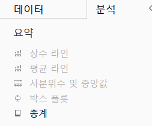

# Second Study Week

- 10강: [차원과 측정값](#10강-차원과-측정값)

- 11강: [시각화](#11강-시각화)

- 12강: [막대그래프](#12강-막대그래프)

- 13강: [누적막대그래프](#13강-누적막대그래프)

- 14강: [병렬막대그래프](#14강-병렬막대그래프)

- 15강: [누적병렬막대그래프](#15강-누적병렬막대그래프)

- 16강: [라인그래프](#16강-라인그래프)

- 17강: [맵작성](#17강-맵작성)

- 18강: [텍스트테이블](#18강-텍스트테이블)

- 19강: [트리맵과 하이라이트테이블](#19강-트리맵과-하이라이트테이블)

- 문제1 : [문제1](#문제1)

- 문제2 : [문제2](#문제2)

- 참고자료 : [참고자료](#참고-자료)


## Study Schedule

| 강의 범위     | 강의 이수 여부 | 링크                                                                                                        |
|--------------|---------|-----------------------------------------------------------------------------------------------------------|
| 1~9강        |  ✅      | [링크](https://youtu.be/3ovkUe-TP1w?si=CRjj99Qm300unSWt)       |
| 10~19강      | ✅      | [링크](https://www.youtube.com/watch?v=AXkaUrJs-Ko&list=PL87tgIIryGsa5vdz6MsaOEF8PK-YqK3fz&index=75)       |
| 20~29강      | 🍽️      | [링크](https://www.youtube.com/watch?v=AXkaUrJs-Ko&list=PL87tgIIryGsa5vdz6MsaOEF8PK-YqK3fz&index=65)       |
| 30~39강      | 🍽️      | [링크](https://www.youtube.com/watch?v=e6J0Ljd6h44&list=PL87tgIIryGsa5vdz6MsaOEF8PK-YqK3fz&index=55)       |
| 40~49강      | 🍽️      | [링크](https://www.youtube.com/watch?v=AXkaUrJs-Ko&list=PL87tgIIryGsa5vdz6MsaOEF8PK-YqK3fz&index=45)       |
| 50~59강      | 🍽️      | [링크](https://www.youtube.com/watch?v=AXkaUrJs-Ko&list=PL87tgIIryGsa5vdz6MsaOEF8PK-YqK3fz&index=35)       |
| 60~69강      | 🍽️      | [링크](https://www.youtube.com/watch?v=AXkaUrJs-Ko&list=PL87tgIIryGsa5vdz6MsaOEF8PK-YqK3fz&index=25)       |
| 70~79강      | 🍽️      | [링크](https://www.youtube.com/watch?v=AXkaUrJs-Ko&list=PL87tgIIryGsa5vdz6MsaOEF8PK-YqK3fz&index=15)       |
| 80~89강      | 🍽️      | [링크](https://www.youtube.com/watch?v=AXkaUrJs-Ko&list=PL87tgIIryGsa5vdz6MsaOEF8PK-YqK3fz&index=5)        |


<!-- 여기까진 그대로 둬 주세요-->
<!-- 이 안에 들어오는 텍스트는 주석입니다. -->

# Second Study Week

## 10강: 차원과 측정값

<!-- 차원과 측정값에 관해 배우게 된 점을 적어주세요 -->

> **🧞‍♀️ 차원과 측정값의 고유한 특성에 대해 설명해주세요.**

```
[차원]
- 정성적인 값 EX) 이름, 카테고리 등 집계되거나 계산되지 X
- 불연속형(개별적으로 구분됨) | 디지털 시계
ex) 제품명 : 개별적으로 그 자체만으로도 정체성을 갖고 있는 것.


[측정값]
- 차원의 세부항목
- 정량적인 수치값 EX) 매출, 수익, 수량 등 
- 연속형(단절이 없는 무한한 범위) | 아날로그 시계
ex) 매출
```

```
❗ 시각화하고자하는 방식에 따라 필드를 변경할 수 있어야함.

EX) 주문일자 필드는
- 불연속형 필드 :년, 월, 일 단위로 시각화하고 싶을 때
- 연속형 필드 : 2020년~2021의 연속되는 데이터로 보고 싶을 떄
```

*Quiz: 차원은 불연속형이고, 측정값은 연속형이다 (o, x)*  => o


## 11강: 시각화

<!-- 시각화 관해 배우게 된 점을 적어주세요 -->

*Quiz: 차원은 대부분 불연속형이며 표 형태로 시각화했을 때 머리글로 표시되고, 측정값은 대부분 연속형이므로 표 형태로 시각화 진행했을 때 패널로 추가된다.(o, x)*  => O


## 12강: 막대그래프

<!-- 막대그래프에 관해 배우게 된 점을 적어주세요 -->
```
✅ 막대그래프 그리는 방법
1) 라인으로 설정 >  마크: 막대로 설정 >> 막대그래프
2) 행과 열에 필드 넣기
* 행·열바꾸기 버튼으로 가로 G > 세로 G 로 쉽게 변환 가능
3) 오름차순 & 내림차순 설정
:오름차순&내림차순 버튼 | 열을 우클릭해서 원하는 필드기준으로 설정

✅마크 활용방법

1) 그래프별 색상 설정 - 색상
: 색상을 다르게 하고 싶은 기준이 되는 필드를 마크의 색상부분에 드래그 & 드롭
* 마크의 색상에서 색깔 편집 가능. 
* 모양 할당 : 그라데이션으로 설정가능

2) 레이블 설정 - 레이블 
: 그래프 위에 띄우고 싶은 레이블의 필드를 드래그 & 드롭
: 레이블 버튼 클릭 > 맞춤의 위치설정으로 레이블의 위치 설정 ㄱㄴ

3) 데이터별 그래프 굵기 설정 - 크기
: 필드를 마크의 '크기' 로 드래그 & 드롭
```

## 13강: 누적막대그래프

<!-- 누적막대그래프에 관해 배우게 된 점을 적어주세요 -->


```
차원별로 측정값의 비율을 보기 위해 사용됨.
- '축'을 활용해 구성비의 변화를 제공할 수 있음

✅ 누적으로 나타내고 싶은 필드를 마크의 세부정보로 드래그 & 드롭
✅ 색상으로 구별하고 싶다면 색상으로 다시 드래그 & 드롭

** 누적을 마크칸의 색상을 활용해서도 할 수 있음
✅ 선반에 있는 필드 활용시, ctrl키를 누른상태로 마크창으로 드래그 & 드롭
✅ 레이블 > 자세히 창에서 표시할 레이블 순서 수정가능
✅ 백분율 확인하기 : 필드 우클릭 > 퀵테이블 계산 > 구성 비율 
```
```
✅ 카테고리가 열에 있고, 매출이 행인 경우, 테이블(옆으로)
    :카테고리 년도별 매출 비율
    -년도별로 카테고리의 매출을 확인 => 각 해마다 여러 카테고리의 매출 비율
    ex) 2021년도의 사무용품, 가구, 의류등의 매출 비율

✅ 카테고리가 열에 있고, 매출이 행인 경우, 테이블(아래로)    
    :카테고리별 년도 매출
    -카테고리별로 매년의 매출을 확인 => 하나의 카테고리가 매년 얼마나 팔렸는가의 비율
    ex) 사무용품의 2021년도 매출 비율
```
<!-- 테이블(아래로)와 테이블(옆으로)의 계산 방식을 습득해보세요. 이에 관련해 아래 참고자료도 있습니다 :) -->

## 14강: 병렬막대그래프

<!-- 병렬막대그래프에 관해 배우게 된 점을 적어주세요 -->
```
날짜: 기본적으로 불연속형

✅ 불연속형(파란색) > 연속형(초록색) 데이터로 바꾸는 방법
1. 데이터 원본에서 바꾸기.
: 필드 우클릭 | 역삼각형 클릭 > 연속형으로 변경
but, 표현해야하는 뷰마다 데이터를 변경해야함 & 충돌가능성 있음

2. 선반에서 데이터 바꾸기
: 선반의 필드 우클릭 > 연속형에 있는 월 선택
(윗부분은 불연속 / 아랫부분은 연속형)

3. 선반으로 끌어올때 우클릭으로 끌어오기

```


> *🧞‍♀️ 끊어진 색상으로 배치되어 표현되는 경우와 이어지는 그라데이션 색으로 표현되는 경우 두 가지가 있습니다. 위 사진의 경우 왜 색깔이 끊어지는 색상으로 표시되지 않고 그라데이션으로 표시되었나요? 데이터의 특성과 관련하여 이야기해 봅시다.*

```
> 해당 데이터가 연속형 데이터로 설정되어있기 때문.
```

## 15강: 누적병렬막대그래프

<!-- 누적병렬막대그래프에 관해 배우게 된 점을 적어주세요 -->
```
[이중 축]
:두 가지 데이터를 하나의 축을 사용해 데이터를 표현하는 방식
> 필드별 마크창이 생성됨
```


> *🧞‍♀️ 위 사진에서는 Profit과 Sales를 측정값으로 두었습니다.  개별 칼럼(태블로에서는 #필드라 명칭합니다)을 열/행에 두는 대신, '측정값'을 사용하고 측정값 선반에 필드를 올려둡니다. 이런 방식을 사용하는 이유가 무엇일지, 어떻게 사용할 수 있을지 고민해보세요*

* 측정값(매출,수익)을 행에 두었을 경우 (이중축설정x)


* 측정값(매출,수익)을 행에 두었을 경우 (이중축설정O)


- 측정값을 측정값 선반에 두는 경우

```
[측정값을 행에 두고 이중축을 설정하지 않은 경우]
-매출과 수익을 각각 독립적으로 확인하고 싶을 때 활용하면 좋을 것 같다.

[측정값을 행에 두고 이중축을 설정한 경우]
-하나의 그래프에서 두개의 측정값이 각각의 축에 따라 나타난다.
-> 값의 범위 차이가 클 경우에 여러개의 측정값을 값을 명확하게 비교할 때 활용할 수 있을 것 같다.

-측정값이 각각의 독립적인 축에 따라 나타나므로, 측정값을 측정값 선반에 둘 때보다 데이터의 실제값을 확인하기 편하다.
->값을 왜곡해서 해석할 가능성이 있음.

[측정값을 측정값 선반에 두었을 때]
-하나의 그래프에서 한개의 축(행)을 통해 나타난다.
-> 다양한 측정값을 동일한 기준에 맞춰 표현하고 싶을 때 활용하면 좋을 것 같다.
-단, 값의 범위 차이가 작은경우에는 비교하기 어려워보인다(화면처럼)
```

<!-- 정답은 없습니다 -->

## 16강: 라인그래프

<!-- 라인그래프에 관해 배우게 된 점을 적어주세요 -->
```
: 데이터의 시간별 추세를 확인하거나 미래값을 예측하려는 경우에 사용
* tableau는 열에 날짜 필드가 있으면 자동으로 라인G를 그림
```

```
라인들을 하나로 이어지게 만들고 싶으면,
년도 필드를 날리고, 월별을 연속형 월별 필드로 변환 
```


* 축동기화 이전
.png)


* 축동기화 이후
.png)

둘 중 범위가 큰 축으로 값이 같아짐.


## 17강: 맵작성

<!-- 맵차트 관해 배우게 된 점을 적어주세요 -->
```
경도와 위도좌표가 있는 위치데이터가 있어야 지도로 표현할 수 있음.
```


```
위도 행 복사(ctrl누르고 옆으로 드래그) 
> 각각 다르게 보고 싶은 마크 설정 > 이중축 설정 
```


```
서로 다른 단위로 다른 값을 표현하고 싶을 때,
마크의 계층 추가(투명 오버레이)를 활용
```


## 18강: 텍스트테이블

- 크로스탭 만들기
.png)
```
열&행 설정 / 보고싶은 값을 마크에 설정
* 행을 여러개 설정해서 세부항목으로 계층화 시킬 수 있음 
( 범주 & 하위범주 )

* 구성비율 설정 방법
: 마크창에 있는 필드의 우클릭 > 퀵테이블 계산 > 구성비율
* 구성비율의 소수점 변경
: 필드의 우클릭 > 서식 > 숫자 > 숫자 사용자 지정  
```


```
분석탭의 요약버튼을 통해서 소계, 열 총합계, 행 총합계를 표시할 수 있음.
```

<!-- 텍스트테이블에 관해 배우게 된 점을 적어주세요-->

## 19강: 트리맵과 하이라이트테이블


```
[트리맵]
:직관적으로 데이터의 크기를 비교할 수 있다.
: 중첩된 사각형으로 표현 / 색상과 크기를 측정값으로 표현

✅하는 방법
나타내고자 하는 필드를 마크창의 텍스트로 드 & 드
원하는 값을 보고 싶은 필드를 마크의 색상과 크기칸으로 드 & 드

✅필터링 하는 방법
텍스트로 드 & 드 한 필드를 필터칸에도 드 & 드
메뉴의 상위 탭 > 기준별 상위 n개 선택.


[하이라이트 테이블]
: 색상이 입혀진 특수 테이블
: 범주형 데이터를 색상으로 비교 가능.
```
> *🧞‍♀️하이라이트 테이블 등에서 두개 이상의 측정값을 사용하는 경우, 함께 색을 표현하게 되면 단위가 달라 정확한 값을 표현할 수 없습니다. 이때 클릭해야 하는 항목은?*

```
마크의 필드값 우클릭 > 별도의 범례 사용 > 각각의 범례칸에서 편집 진행
```


## 문제1

지민이는 superstore의 한국 수출 관리 업무를 맡고 있습니다. 국가/지역이 우리나라, 즉 'South Korea'인 데이터만을 필터링하여, 상품 하위범주 별로 각 하위범주가 매출의 비율 중 얼마만큼을 차지하는지를 트리맵으로 확인하고 싶습니다. 트리맵의 각 네모 안에 표시되는 텍스트에는 **해당 범주의 이름과 전체에서 해당 범주가 차지하는 비율**이 표시되었으면 합니다.

지민이를 도와주세요! (풀이를 찾아가는 과정을 기술해주세요)
```
1) 필터링 선반에서 국가 드래그&드랍 > south korea만 설정
2) 확인하고 싶은 데이터인 하위범주 필드를 마크의 텍스트로 드래그 & 드랍
3) 하위범주를 매출별로 크기를 다르게 설정하고 싶은 것 -> 매출필드를 마크의 크기로 드래그 & 드랍
4) 하위범주의 매출별 비율을 표시하기 위해서 텍스트로 드래그&드랍
5) 확인하기 위해서 퀵테이블에서 구성비율 선택 > 다음을 사용하여 계산 > 테이블(옆으로)
```

## 문제2

주현이는 국가/지역별로 매출과 수익의 증감을 시간에 흐름에 따라 표현하고자 합니다. 특히 **한국/중국/일본**을 비교하고자 해당 3국을 남기고 필터링했고, 3개 국가를 매출과 수익이라는 두 가지 지표로 확인해보았습니다.

아래는 위 설명을 표현해본 예시입니다.


레퍼런스와 꼭 같지 않아도 자유롭게 표현하고, 그 과정을 기술해주세요.


```
1) 국가 필터링
2) 필터링한 필드를 열로 설정 
3) 배송날짜의 월을 2021년부터 2025년도까지 이어지는 선으로 보고싶어서 우클릭 > 연속형의 월로 전환
4) 매출과 수익을 행으로 설정
5) 매출과 수익을 비교하기 편하도록(하나의 행을 공유하기 위해서) 이중축으로 설정
```
### 참고 자료

테이블 계산에서 '다음을 사용하여 계산'에는 테이블 당 계산과 패널 당 계산이 있습니다. 이에 대해 이해하는 것이 꼭 필요하기 때문에, 외부 레퍼런스를 참고하여 이 단계에서 꼭! 학습 후, 넘어가주세요 :)


[참고 외부자료 링크는여기를클릭하십시다](https://velog.io/@eunsuh/Tableau-%EB%A0%88%EB%B2%A8UP-%EA%B0%95%EC%9D%98-%EC%A0%95%EB%A6%AC-1-%ED%85%8C%EC%9D%B4%EB%B8%94-%EA%B3%84%EC%82%B0)

```
이해를 하자,,
```


```
* Quick Table Calc
: 비즈니스/일상에서 사용도/빈도가 높은 것들을 모아놓은 패키지

* 테이블 = 전체범위 | 패널 = 일부 범위 | 셀 = 하나의 특정 값

* 현재 뷰에서는 셀 = 분기 /  패널 = 연도

테이블 = 전체(처음부터 끝까지), 
테이블(옆으로) = 옆으로 처음부터 끝까지
-> 값이 2019년도의 Q1부터 2022년도의 Q4까지 누적으로 더해져서 총계 반환


테이블(아래로) = 위에서 아래로 처음부터 끝까지.
-> 한 분기의 값이 central의 값부터 west의 값까지 누적돼서 반환됨.


*패널(옆으로)
19년도의 Q1~Q4값 누적해서 더하고, 2020년도의 Q1부터 다시 집계시작
```


### 참고자료 2

수익의 경우, 마이너스가 표시될 수 있습니다.