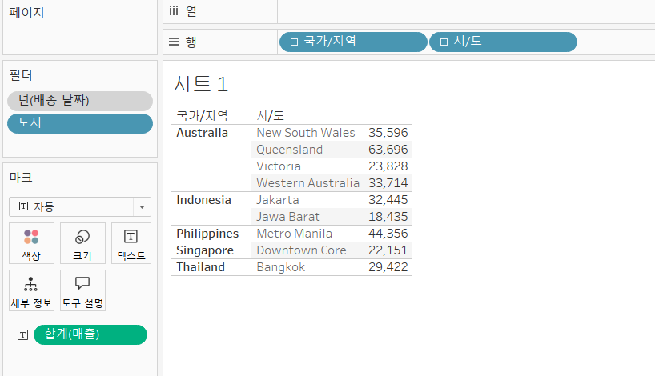
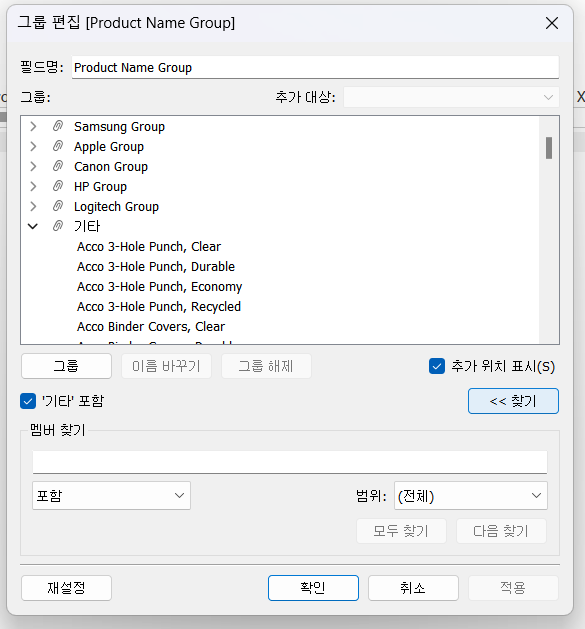

# Third Study Week

- 20강: [파이와 도넛차트](#20강-파이와-도넛차트)

- 21강: [워드와 버블차트](#21강-워드와-버블차트)

- 22강: [이중축과 결합축](#22강-이중축과-결합축)

- 23강: [분산형 차트](#23강-분산형-차트)

- 24강: [히스토그램](#24강-히스토그램)

- 25강: [박스플롯](#25강-박스플롯)

- 26강: [영역차트](#26강-영역차트)

- 27강: [간트차트](#27강-간트차트)

- 28강: [필터](#28강-필터)

- 29강: [그룹](#29강-그룹)


- 문제1 : [문제1](#문제1)

- 문제2 : [문제2](#문제2)

- 참고자료 : [참고자료](#참고-자료)


## Study Schedule

| 강의 범위     | 강의 이수 여부 | 링크                                                                                                        |
|--------------|---------|-----------------------------------------------------------------------------------------------------------|
| 1~9강        |  ✅      | [링크](https://youtu.be/3ovkUe-TP1w?si=CRjj99Qm300unSWt)       |
| 10~19강      | ✅      | [링크](https://www.youtube.com/watch?v=AXkaUrJs-Ko&list=PL87tgIIryGsa5vdz6MsaOEF8PK-YqK3fz&index=75)       |
| 20~29강      | ✅      | [링크](https://www.youtube.com/watch?v=Qcl4l6p-gHM)      |
| 30~39강      | 🍽️      | [링크](https://www.youtube.com/watch?v=e6J0Ljd6h44&list=PL87tgIIryGsa5vdz6MsaOEF8PK-YqK3fz&index=55)       |
| 40~49강      | 🍽️      | [링크](https://www.youtube.com/watch?v=AXkaUrJs-Ko&list=PL87tgIIryGsa5vdz6MsaOEF8PK-YqK3fz&index=45)       |
| 50~59강      | 🍽️      | [링크](https://www.youtube.com/watch?v=AXkaUrJs-Ko&list=PL87tgIIryGsa5vdz6MsaOEF8PK-YqK3fz&index=35)       |
| 60~69강      | 🍽️      | [링크](https://www.youtube.com/watch?v=AXkaUrJs-Ko&list=PL87tgIIryGsa5vdz6MsaOEF8PK-YqK3fz&index=25)       |
| 70~79강      | 🍽️      | [링크](https://www.youtube.com/watch?v=AXkaUrJs-Ko&list=PL87tgIIryGsa5vdz6MsaOEF8PK-YqK3fz&index=15)       |
| 80~89강      | 🍽️      | [링크](https://www.youtube.com/watch?v=AXkaUrJs-Ko&list=PL87tgIIryGsa5vdz6MsaOEF8PK-YqK3fz&index=5)        |


<!-- 여기까진 그대로 둬 주세요-->
<!-- 이 안에 들어오는 텍스트는 주석입니다. -->

# Third Study Week

## 20강: 파이와 도넛차트
<!-- 파이와 도넛차트에 관해 배우게 된 점을 적어주세요 -->


> **🧞‍♀️ 도넛차트를 생성하는 법을 기록해주세요.**

** 도넛차트는 파이차트의 총 합계를 나타내는 등의 보조 역할로 많이 사용됨.

1. 임의의 축 설정 : 열 선반의 빈칸을 더블 클릭한 후, 0을 입력하면 임의의 축이 생긴다. ctrl로 옆으로 드래그래 두개의 원을 만들것.

2. 두번째 원에 해당하는 원의 마크를 제거한 후, 도넛차트에서 표현할 값을 마크로 표현하면 된다.

3. 두번째 0을 우클릭해서 이중축을 선택

4. 두번째 원의 색을 흰색, 시트에서 우클릭 > 서식 > 격자모양 클릭 후 필요없는 선들을 제거해준다. 


## 21강: 워드와 버블차트
<!-- 워드와 버블차트에 관해 배우게 된 점을 적어주세요 -->


**워드 클라우드**

: 문서 내에서 등장하는 키워드가 얼마나 자주 등장하는가를 크기로 표현함. 

> 생성하는 방법


1. 보고자 하는 값을 우클릭해서 크기에 가지고 간다. 

2. 얼마나 자주 등장하는 가를 보고 싶은 것이기에 > 카운트선택

3. 같은 필드를 레이블에도 드래그 & 드랍한 후, 마크의 종류를 텍스트로 변환

3. 다른 값을 색상 마크에 갖다 두면 등장하는 빈도수별 매출도 한눈에 확인할 수 있음.

## 22강: 이중축과 결합축
<!-- 이중축과 결합축에 관해 배우게 된 점을 적어주세요 -->


```
✅이중축을 사용할 경우. 각각의 마크를 사용할 수 있음
✅결합축을 사용하는 방법:
    필드를 그래프의 왼쪽 축으로 끌고와서 초록색 박스가 만들어지면 드랍 
    -> 측정값 영역이 새로 생기고, 두 값의 축 중에서 큰 값의 축을 공유하는 그래프에 데이터가 추가됨.
```

## 23강: 분산형 차트
<!-- 분산형 차트에 관해 배우게 된 점을 적어주세요 -->

: ***파라미터간의 상관관계***를 파악하는데 유용한 그래프

**추세선 설정방법**


```
✅전체 추세선이 보고싶다면,
추세선 우클릭 > 전체 추세선 편집 > 요소칸의 체크 해제
```
---
**전체 추세선과 제품별 추세선을 한번에 보고싶다면,**


```
✅ 이중축 활용

-> 열 선반의 필드 ctrl + 드래그해서 두개의 그래프를 만들고, 하나의 그래프에서는 전체 추세선을, 하나의 그래프에서는 제품별 추세선을 생성

-> 추가로 생성된 머리글은 우클릭해서 머리글 표시 해제
```
시각화된 분산형 차트를 통해서
- 매출 상승에 따른 일반적인 수익 상승 추이와
- 추세와 상반되는 제조업체를 확인할 수 있음


## 24강: 히스토그램
<!-- 히스토그램에 관해 배우게 된 점을 적어주세요 -->


- 연속형 측정값을 범위 혹은 구간 차원으로 그룹화함.
- 오직 측정값만 활용


> 구간 차원?

일정한 크기의 포켓을 직접 만들어, 그 안에 값을 담아 표현시키는 도구

**[생성방법]**

:필드 우클릭 > 만들기 > 구간차원

*구간차원 = 구간별로 담을 포켓의 크기 (몇 단위로 구간을 나눌것인지)


**[히스토그램 생성방법]**
1. 만들어진 구간차원을 열에 설정
2. y값을 행에 설정후, 연속형인지 확인
3. y값으로 보고 싶은 값을 설정 ex)합계? 카운트?

---

> 구간차원 없이 히스토그램 그리는 방법
확인하고 싶은 값을 열 선반에 올린 뒤, 표현방식에서 히스토그램 선택

```
✅값이 너무 극단적으로 표현되어 있어 확인이 어려운 경우,

축 편집 > 눈금에서 로그를 활성화

<로그>
양수 - 양수값만 눈금에 표현
대칭 - 음수, 0, 양수을 포함하는 데이터를 로그 배율측에 표시하게 함.
```

```
✅히스토그램과 막대그래프의 차이
히스토그램 : 연속형 측정값을 통해 수치 데이터의 빈도를 표시
=> 양적 그래프
막대와 막대사이의 공간 x

막대그래프 : 불연속형의 여러 범주의 데이터를 비교하기 위해 사용
막대와 막대사이의 공간 o
```

## 25강: 박스플롯
<!-- 박스플롯에 관해 배우게 된 점을 적어주세요 -->


```
라인이 가로로 평평하게 그려진다면 값의 총합으로 자동집계가 되어있진 않은지 확인해볼 것.
 -> 추가로 더 살펴볼 필드를 세부사항에 드래그하면 해결됨.
```
## 26강: 영역차트
<!-- 영역차트에 관해 배우게 된 점을 적어주세요 -->
: 연속형 데이터의 누계를 표현하는데 용이함.


- 열과 행 선택후, 표현방식에서 영역차트 클릭
- 레이블과 세부사항으로 수치와 구성비율 표현 가능.

## 27강: 간트차트
<!-- 간트차트에 관해 배우게 된 점을 적어주세요 -->
: 시간 경과에 따른 ***기간***을 시각화하는데 사용


월별로 제품마다 걸린 배송기간을, 배송형태로 구분해서 시각화한 그래프

- 보고 싶은 값 : 배송기간 & 배송형태 => 마크에 드롭
- 배송기간 : 상위 분석 탭 > 계산된 필드 생성 활용해서 필드 생성
- 배송기간을 크기로, 배송 형태를 색상에 드랍해서 시각화 한 그래프


## 28강: 필터
<!-- 필터에 관해 배우게 된 점을 적어주세요 -->
**Tableau가 필터를 실행하는 순서**

: 추출 > 데이터원본 > 컨텍스트 > 차원 > 측정값 > 필터

1) 추출: 연결에 라이브&추출부분
    
    - 우측 상단 <연결>부분에서 라이브 & 추출 부분 中, 
'추출' 선택 > 옆의 <편집> 버튼에서 추가하고자 하는 필터 추가

2) 데이터 원본 필터 : 작업을 위한 데이터 中 일부만 워크 스페이스에 불러올 때 사용


    - 우측 상단 <연결>부분에서 라이브 & 추출 부분 中, '라이브' 선택 > 옆의 <편집> 버튼에서 추가하고자 하는 필터 추가

3) 컨텍스트 필터 : 필터 중 상위 필터

    - 여러가지 필터를 설정했을 때, 다른 필터가 컨텍스트 필터에 종속해서 작동됨.


**컨텍스트 필터 적용 전**


**컨텍스트 필터 적용 후**


상위필터를 적용하고 싶은 필터 우클릭 > 컨텍스트의 추가

4) 차원필터 :  필드를 필터선반에 드래그 & 드랍해서 일반, 와일드카드, 조건, 상위 로 필터 설정 가능.

## 29강: 그룹
<!-- 그룹에 관해 배우게 된 점을 적어주세요 -->

**그룹화 하는 방법**
1. 수동으로 그래프를 드래그 한 후, 우클릭으로 그룹화
2. 제품 필드를 우클릭 > 만들기 > shift를 사용해 범위 설정 후 하단의 만들기 버튼으로 그룹화.


## 문제 1.

```js
유정이는 superstore 데이터셋에서 '주문' 테이블을 보고 있습니다.
1) 국가/지역 - 시/도- 도시 의 계층을 생성했습니다. 계층 이름은 '위치'로 설정하겠습니다.
2) 날짜의 데이터 타입을 '날짜'로 바꾸었습니다.

코로나 시기의 도시별 매출 top10을 확인하고자
1) 배송 날짜가 코로나시기인 2021년, 2022년에 해당하는 데이터를 필터링했고
2) 위치 계층을 행으로 설정해 펼쳐두었습니다.
이때, 매출의 합계가 TOP 10인 도시들만을 보았습니다.
```


```
겉보기에는 전체 10개로, 잘 나온 결과처럼 보입니다. 그러나 유정이는 치명적인 실수를 저질렀습니다.
오늘 배운 '컨텍스트 필터'의 내용을 고려하여 올바른 풀이 및 결과를 구해주세요.
```

```
배송날짜 데이터, 도시 데이터, 합계(매출) 중 어떤 것이 먼저 필터링이 되어야하는가를 생각해봤다.
`2021년과 2022년에 해당하는 데이터 중`에서도 도시별 매출 합계 상위10개를 보고싶은 것이기 때문에 도시와 합계(매출)데이터가 배송날짜를 2021년과 2022년도 필터링한 것에 종속되어야한다.
=> 년(배송날짜)에 컨텍스트 필터를 적용하면 오류를 해결할 수 있을 것 같다.
```
<!-- DArt-B superstore가 아닌 개인 superstore 파일을 사용했다면 값이 다르게 표시될 수 있습니다.-->

## 문제 2.

```js
태영이는 관심이 있는 제품사들이 있습니다. '제품 이름' 필드에서 '삼성'으로 시작하는 제품들을 'Samsung group'으로, 'Apple'으로 시작하는 제품들을 'Apple group'으로, 'Canon'으로 시작하는 제품들을 'Canon group'으로, 'HP'로 시작하는 제품들을 'HP group', 'Logitech'으로 시작하는 제품들을 'Logitech group'으로 그룹화해서 보려고 합니다. 나머지는 기타로 설정해주세요. 이 그룹화를 명명하는 필드는 'Product Name Group'으로 설정해주세요.

(이때, 드래그보다는 멤버 찾기 > 시작 문자 설정하여 모두 찾아 한번에 그룹화해 확인해보세요.)
```




```
그룹편집 > 찾기 버튼  > 시작문자 설정 > 해당 값 확인 후 확인 누르면 그룹 생성
```


```js
해당 그룹별로 어떤 국가/지역이 주문을 많이 차지하는지를 보고자 합니다. 매출액보다는 주문량을 보고 싶으므로, 주문Id의 카운트로 계산하겠습니다.

기타를 제외하고 지정한 5개의 그룹 하위 목들만을 이용해 아래와 같이 지역별 누적 막대그래프를 그려봐주세요.
```


**실습결과**
