# Fourth Study Week

- 30강: [계층](#30-계층)

- 31강: [집합](#31-집합)

- 32강: [결합집합](#32-결합집합)

- 33강: [계산된 필드](#33-계산된-필드)

- 34강: [행수준계산](#34-행수준계산)

- 35강: [집계계산](#35-집계계산)

- 36강: [테이블계산](#36-테이블계산)

- 37강: [퀵테이블계산(1)](#37-퀵테이블계산1)

- 38강: [퀵테이블계산(2)](#38-퀵테이블계산2)

- [문제1](#문제-1)

- [문제2](#문제-2)

- [문제3](#문제-3)

## Study Schedule

| 강의 범위     | 강의 이수 여부 | 링크                                                                                                        |
|--------------|---------|-----------------------------------------------------------------------------------------------------------|
| 1~9강        |  ✅      | [링크](https://www.youtube.com/watch?v=AXkaUrJs-Ko&list=PL87tgIIryGsa5vdz6MsaOEF8PK-YqK3fz&index=84)       |
| 10~19강      | ✅      | [링크](https://www.youtube.com/watch?v=AXkaUrJs-Ko&list=PL87tgIIryGsa5vdz6MsaOEF8PK-YqK3fz&index=75)       |
| 20~29강      | ✅      | [링크](https://www.youtube.com/watch?v=AXkaUrJs-Ko&list=PL87tgIIryGsa5vdz6MsaOEF8PK-YqK3fz&index=65)       |
| 30~38강      | ✅      | [링크](https://youtu.be/e6J0Ljd6h44?si=nhGbB7GsdOCqj15f)       |
| 39~49강      | 🍽️      | [링크](https://www.youtube.com/watch?v=AXkaUrJs-Ko&list=PL87tgIIryGsa5vdz6MsaOEF8PK-YqK3fz&index=45)       |
| 50~59강      | 🍽️      | [링크](https://www.youtube.com/watch?v=AXkaUrJs-Ko&list=PL87tgIIryGsa5vdz6MsaOEF8PK-YqK3fz&index=35)       |
| 60~69강      | 🍽️      | [링크](https://www.youtube.com/watch?v=AXkaUrJs-Ko&list=PL87tgIIryGsa5vdz6MsaOEF8PK-YqK3fz&index=25)       |
| 70~79강      | 🍽️      | [링크](https://www.youtube.com/watch?v=AXkaUrJs-Ko&list=PL87tgIIryGsa5vdz6MsaOEF8PK-YqK3fz&index=15)       |
| 80~89강      | 🍽️      | [링크](https://www.youtube.com/watch?v=AXkaUrJs-Ko&list=PL87tgIIryGsa5vdz6MsaOEF8PK-YqK3fz&index=5)        |

<!-- 여기까진 그대로 둬 주세요-->

> **🧞‍♀️ 오늘의 스터디는 지니와 함께합니다.**


## 30. 계층

<!-- 계층 구조와 관련된 개념, 사용 방법 등을 적어주세요. -->
뷰에서 데이터를 Drill Down해 값을 세부적으로 찾을 때 유용한 방법임

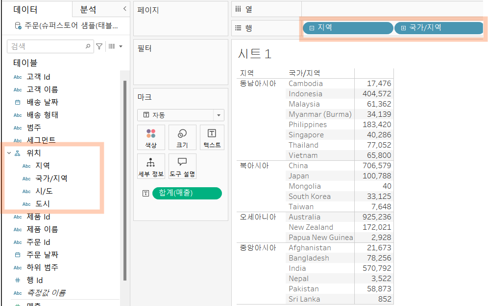

- 시간,년도의 흐름 혹은
- 위치/지리적 데이터에 사용 多


## 31. 집합

<!-- 집합의 정의 및 활용 방법에 대해 알게 된 점을 적어주세요. -->
사용자가 직접 조건을 설정하고, 그 조건을 충족하는 값끼리 데이터를 구분할 수 있는 방법

**ex)수익을 많이 낸 도시 10개** 

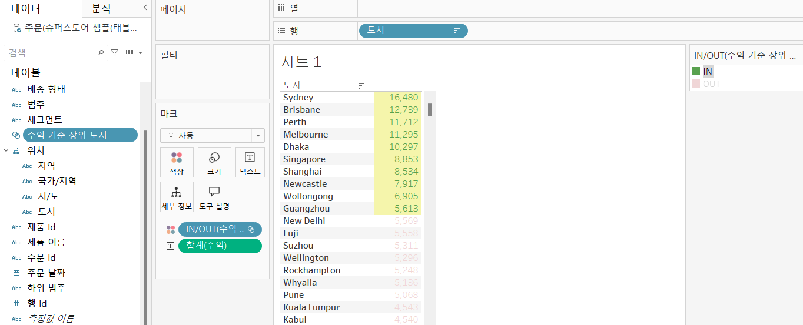

```
<일반tab> - 그룹화처럼 보고 싶은 데이터값들만 선택해서 구분함
<조건tab> - 원하는 조건을 설정해서 조건을 충족하는 값들만 구분함
<상위tabl> - 필드별 상위/하위 n개의 값들만 구분함

"집합"은 한가지의 조건만 설정가능함.
-> 조건을 만족하느냐, 못하느냐 YES OR NO!
```

## 32. 결합집합

<!-- 결합집합의 개념 및 사용 사례를 적어주세요. -->
두 가지의 조건을 지정해서 데이터를 구분하고 싶을 때 사용.

EX) 매출이 5만원 이상, 수익률 10%이상인 도시의 데이터를 구분하고 싶다면
1. 매출이 5만원이상을 만족하는 집합 만들기
2. 수익률이 10% 이상을 만족하는 집합 만들기
3. 하나의 집합 우클릭 > 결합된 집합 만들기 > 원하는 옵션 선택


```
1) 합집합 (A나 B 둘 중 하나에만 속해도 구분됨)
2) 교집합 (A와 B 두개의 조건을 모두 만족해야 구분됨)
3) A집합의 조건만 만족해야 구분됨
4) B집합의 조건만 만족해야 구분됨
```

## 33. 계산된 필드

<!-- 계산된 필드를 사용하는 방법과 예시를 적어주세요. -->
1. 데이터 패널을 통해 생성하는 방법
2. 분석탭을 활용해 생성하는 방법
3. 사용하고자 하는 필드에 우클릭해서 만드는 방법

**계산식에 필드를 DRAG & DROP 할 수 있고, 직접 입력해도 관련필드가 나열되어 나타남.

>**예시) 수익률(%) 필드 생성**
```
수익률 = 전체 수익 합계 / 전체 매출 합계
=> SUM([수익]) / SUM([매출])의 계산식으로 수익률 필드를 생성

필드 우클릭 > 기본 속성 > 숫자형식 > 백분율로 설정해서 백분율(%)을 표시하도록 설정
```

**[계산식 작성 시 주의할 점]**

❗필드이름은 대괄호 안에 넣어 사용

❗문자값을 입력할 때는 작은 따옴표(')사용

❗주석 작성은 // (2개!!)

## 34. 행수준계산

<!-- 행수준 계산의 의미와 적용 방법을 적어주세요. -->
**[계산된 필드의 종류] - 기본계산, 테이블 계산, LOD표현식**
>기본계산

***데이터 원본***에 대한 행 수준 계산 OR 집계 계산

행 수준의 계산: 각 행의 데이터를 개별적으로 처리해서 계산 결과 반환


✅**행 수준 계산**
```
행 수준 계산 : 각 행의 개별적인 성과를 보고 싶을 때 활용
ex) 각 제품별 수익률을 보고 싶을 때.
ex) 고객 이름의 성과 이름을 따로 분리해서 보고 싶을 때 
-> 각 고객이름 행마다의 작업이 필요함
```


## 35. 집계계산

<!-- 집계계산의 정의 및 활용 사례에 대해 알게 된 점을 적어주세요. -->

✅**집계 계산**
```
여러 행의 데이터를 집계한 후에 계산을 수행함.
요약된 성과를 보고싶을 때 활용
ex) 모든 거래의 총 수익률을 확인하고 싶을 때.
ex) 년도별 주문건수
```
직접 만든 집계계산 필드는 '집계 (필드이름)'의 형식으로 표시되고, 

tableau자체가 만든 필드는 합계(필드이름)과 같은 형식으로 표시됨.

집계필드에서는 우클릭해서 수정이 불가함.

## 36. 테이블계산

<!-- 테이블 계산의 개념 및 사용 방법을 적어주세요. -->
***뷰에 보이는 내용을 바탕***으로 데이터가 계산됨.

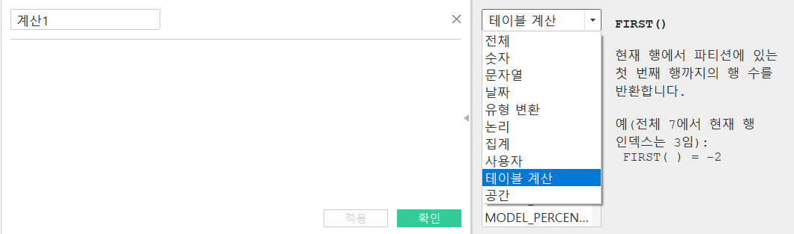

계산된 필드 만들기 > 드롭다운에서 '테이블계산' 선택 

```
이미 집계된 데이터를 기반으로 계산하는 것.

ex) 누적 합계: RUNNING_SUM 함수 사용 
ex) 전월과의 매출 차이 계산: sum([매출])-lookup(sum([매출]),-1) 
```

## 37. 퀵테이블계산(1)
<!-- 퀵테이블 계산의 원리 및 예제에 대해 알게 된 점을 적어주세요. -->
테이블 계산에서 자주 쓰이는 유형들을 간단한 클릭만으로 계산가능하도록 만들어 놓은 기능.


>1.누계 : 집계한 값을 누적한 값 / 한 번더 집계하는 방식

**ex) 분기별 누적 매출 & 월별 매출 차트**

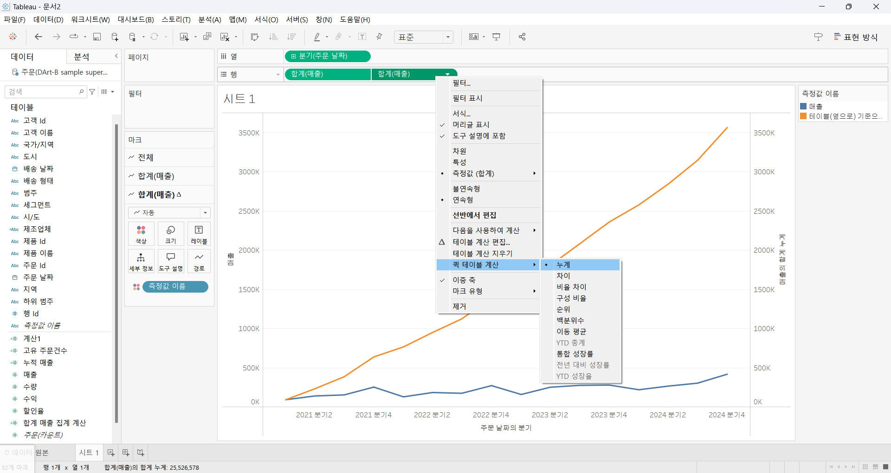

매출 필드를 ctrl해서 복제필드를 만든 후, 해당 필드를 퀵테이블 계산을 활용해 매출 누계 필드화하여 이중축 생성.

>2.차이 : 측정값이 기준값과 어느 정도 차이가 나는지 구하는 계산 유형

**ex) 각 제품마다의 연도별 매출 차이**
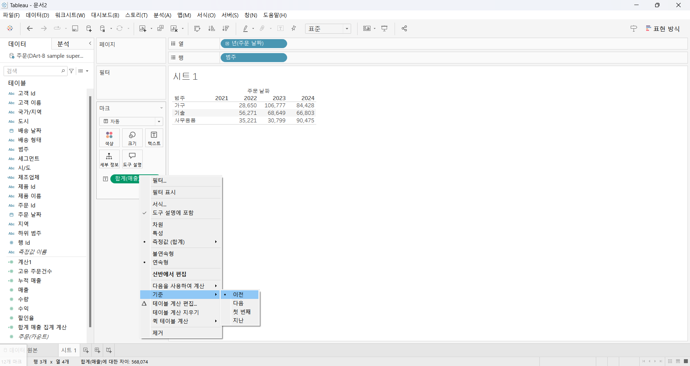

>3.비율차이 : 측정값들 사이의 성장률 또는 % 차이를 표현

**ex) 월별수익차이(%)**
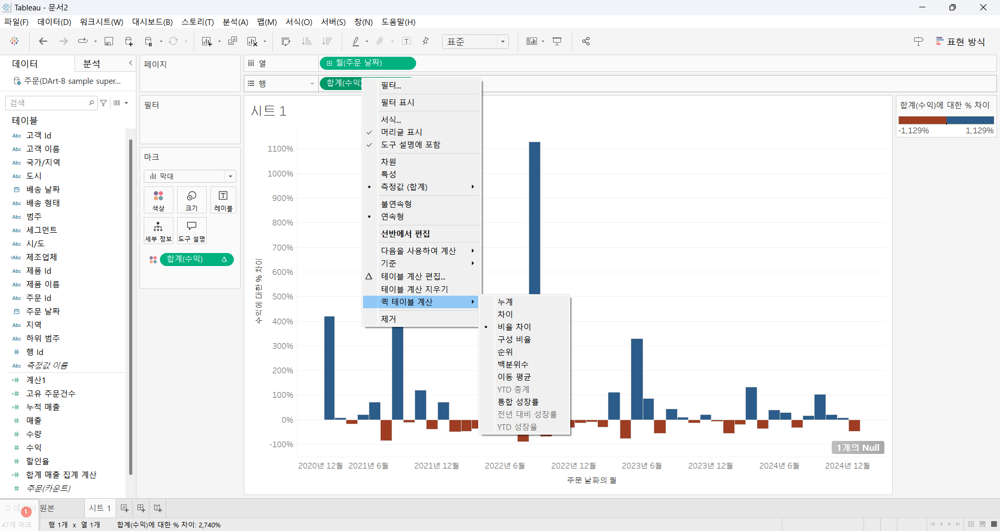

0을 기준으로 지난 달에 비해 이번달에 얼마나 수익을 냈는지를 가시성 좋게 확인할 수 있음.

**범례에서 색상기준을 2로 설정하면 비교가 더 쉬워짐.

>4.순위

**ex) 지역별 제품 매출 순위와 구성비율**
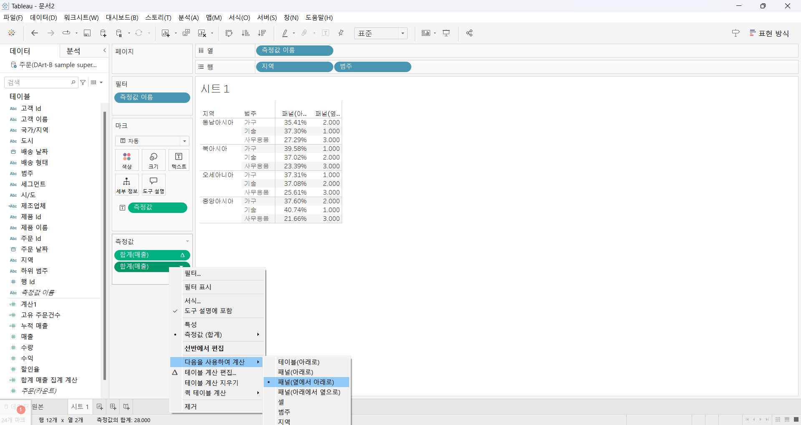

*구성비율: 전체에서 각 항목들의 비중을 확인할 때 활용

❗지역 내에서의 순위를 확인하고 싶은 것이기 때문에, 퀵테이블 계산 방법을 **패널(지역)** 에서 옆으로 아래로 설정.

❗구성비율 또한 한 지역내의 제품별 구성비율을 보고 싶은 것이기 때문에 **패널**단위에서 계산 진행

> 5.백분위수

전체에서 각 데이터의 백분위를 표시할 경우

ex) 매출이 많은 고객과 적은 고객을 확인하고 싶을 때 활용가능

매출필드 > 퀵테이블 계산 > 백분위수 설정 > 오름/내림차순으로 확인.

## 38. 퀵테이블계산(2)

<!-- 이동평균, YTD 총계, 전년 대비 성장률, YTD 성장률 등 본 강의에서 알게 된 점을 적어주세요. -->


>1.이동평균

이전의 값부터 현재까지 값에 대한 평균을 낼 때 활용

주로 **주식데이터**에서 많이 사용함.

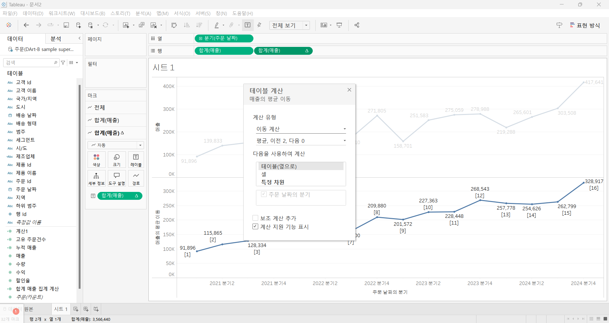
```
✅평균,이전2, 다음0 이 뜻하는 바

현재 레이블로 표시되는 각각의 분기를 기준으로, 이전 2개의 분기(이전 2)와 현재분기의 분기(다음 0)별 평균을 나타내고 있다는 것을 의미
```

>2.YTD(Year to Date) 총계

:특정시점을 기준으로 해당년도부터 그 시점까지의 누적총계

❗기본적으로는 누계와 같은 개념이지만, 연도보다 하위레벨인 '분기' 혹은 '월'이 있어야 사용가능하다.

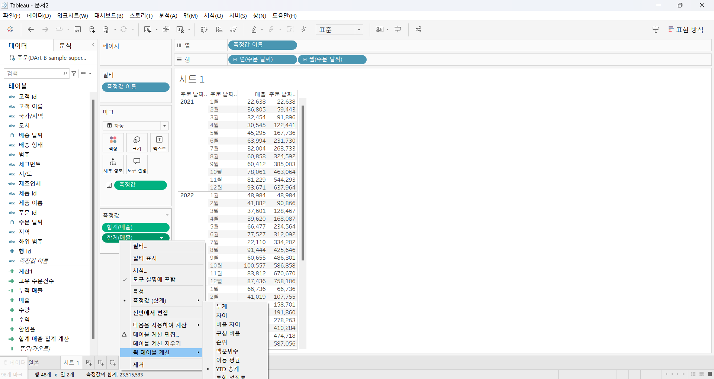

** 퀵테이블을 적용한 필드와 적용하지 않은 필드를 비교해서 보면 잘 적용되었는지 확인이 가능함.

> 3.전년대비 성장률

같은 월을 기준으로 이전 년도 대비 얼마정도 성장했는지를 살펴보는데 활용.(누적X)

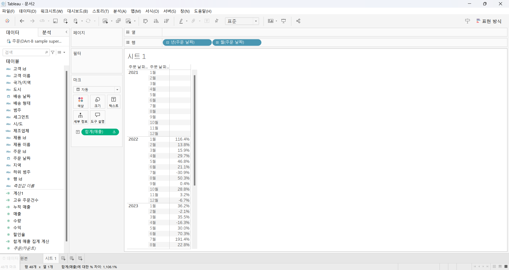

>4.YTD성장률

**올바르게 적용되었는지 검증하는 방법**

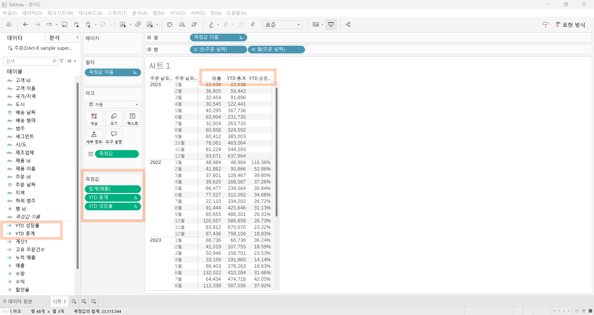
```
1. 하나의 매출을 더 만들어 측정값 카드에 퀵테이블계산이 적용된 매출 필드를 더블클릭 
( 오류가 난다면, CTRL누르고 데이터 패널로 던질 것 -> 임시필드인 계산1과 계산 11이 생성될 것 ) 
2. 계산1필드는 YTD총계 , 계산11필드는 YTD성장률로 설정
3. YTD총계값을 두개의 측정값사이에 넣으면 검증가능
```
## 문제 1.

규석이는 이제껏 매출을 올리는 데에 힘썼었지만, 왠지 모르게 주머니에 들어오는 돈이 없어 속상합니다. 

그래서 매출이 상위 20곳에 속하지만, 수익률(%)이 마이너스인 시/도를 확인하려고 합니다.

> 수익률은 SUM([수익]) / SUM([매출])로 정의합니다.

어떤 집합을 만들었고, 어떤 결합을 하였는지를 중심으로 기술하고, 결과 자료를 첨부해주세요. 

(텍스트 표 형태이며, 색상으로 위 집합을 구분할 수 있게 만들어주세요.)

---
### 문제 1 답안
<!-- 아래 예시 이미지를 삭제하고, 직접 만든 시트 사진을 올려주세요. 시트의 이름은 본인 이름으로 기입해주세요-->


```
1, 매출이 상위20곳에 속한다
2, 동시에 수익률(%)가 마이너스이다  --- 수익률(%) < 0 

이라는 두개의 조건을 만족해야하기에 2개의 집합을 만들어 '결합집합'을 진행했고,
매출 상위20곳에 속하면서도 수익률(%)이 마이너스인 시/도라는 2개의 조건을 '동시에' 만족해야하기에 교집합을 나타내는 2번째 옵션을 선택했다.

매출과 수익률을 측정값으로 나타내어, 매출 상위20개중에서도 수익률이 -인 값만 파란색으로 구분된 것을 확인할 수 있다. 
```

## 문제 2.
선희는 주문 Id별로 주문에서 배송까지에 걸리는 날짜 일수가 궁금했습니다. 
그래서 주문 ID별로 주문에서 배송까지 걸리는 일자를 '배송까지 걸린 일수'라는 계산된 필드로 만들고, 이를 마크에 올린 후 확인해보았습니다. 
이때, 계산된 필드의 식은 'DATEDIFF' 함수를 이용하였습니다.

배송까지 걸린 일수 계산을 위한 DATEDIFF 함수 수식을 적어주세요.

```
DATEDIFF('day',[주문 날짜],[배송 날짜])
❗day를 적을때 작은 따옴표(') 와 함께 작성할 것
```


그런데 위 그림처럼 '주문 날짜'와 '배송 날짜'를 함께 행에 올려 확인해보니, 주문날짜와 배송날짜의 차이가 '배송까지 걸린 일수'와 다릅니다.

ID-2021-11126을 보니, 11월 26일 배송에 11월 30일 배송이면 4일 차이인데, 12일이 걸렸다고 하네요. 왜 이런 문제가 생긴걸까요?

```
직접 계산해서 만든 필드가 측정값으로 인식되어, 해당 주문id로 주문한 모든 기록의 일수를 합계한 값이 출력되었기 때문이다.
```

그리고 이를 해결하기 위해서는 어떻게 해야 할까요?

```
해당 필드 우클릭 > 차원값으로 변경 > 다시 마크창의 레이블에 드래그 & 드롭하면
⭐우왕 문제 해결⭐
```
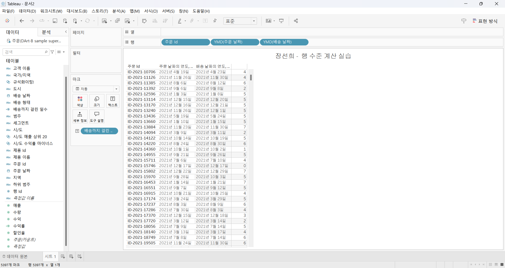


## 문제 3.

다음은 Tableau의 다양한 계산을 사용할 수 있는 경우를 빈칸으로 두고 문제를 작성한 것입니다. 각 빈칸에 적합한 계산 유형을 채워보세요.

보기
> **누계, 차이, 비율 차이, 구성 비율, 순위, 백분위수, 이동 평균, YTD 총계, 통합 성장률, 전년 대비 성장률, YTD 성장률**

| 계산 유형               | 설명                                                                 | 사용 예시                                                                                          |
|-------------------------|----------------------------------------------------------------------|-----------------------------------------------------------------------------------------------------|
| 누계           | 데이터의 누적 합계를 계산                                             | 한 기업이 월별 매출 데이터를 누적하여 연간 매출 추이를 보고 싶을 때 사용                                      |
| ____________            | 연속 데이터 포인트 간의 차이를 계산                                    | 한 기업이 월별 매출 데이터에서 전월 대비 매출 증감량을 분석하고 싶은 경우                                        |
| ____________            | 연속 데이터 포인트 간의 비율 변화를 계산                               | 한 기업이 월별 매출 데이터에서 전월 대비 매출 증감률(%)을 분석하고 싶은 경우                                      |
| 구성 비율            | 전체에서 각 데이터 포인트의 비율을 계산                                | 한 기업이 전체 매출에서 각 제품군이 차지하는 비율을 보고 싶을 때 사용                                           |
| 순위            | 데이터의 순위를 매깁니다                                              | 한 기업이 제품별 매출 데이터를 순위별로 정렬하여 상위 10개 제품을 분석하고 싶은 경우                              |
| 백분위수            | 데이터의 백분위를 계산                                               | 한 기업이 고객별 구매 금액 데이터를 백분위수로 나누어 상위 25% 고객을 분석하고 싶은 경우                          |
| 이동 평균            | 일정 기간의 평균을 계산                                               | 한 기업이 주간 매출 데이터에서 4주 이동 평균을 계산하여 트렌드를 분석하고 싶은 경우                              |
|             | 연초부터 현재까지의 총계를 계산                                      | 한 기업이 월별 매출 데이터를 연초부터 현재까지 누적하여 연간 매출 목표 달성 여부를 분석하고 싶은 경우             |
| ____________            | 일정 기간 동안의 연평균 성장률을 계산                                  | 한 기업이 5년 간 매출 데이터를 바탕으로 연평균 성장률(CAGR)을 계산하고 싶은 경우                                  |
| ____________            | 전년 동기간 대비 성장률을 계산                                        | 한 기업이 월별 매출 데이터에서 전년 동월 대비 매출 성장률을 분석하고 싶은 경우                                    |
| ____________            | 연초부터 현재까지의 성장률을 계산                                     | 한 기업이 올해 연초부터 현재까지의 매출이 전년 동기 대비 얼마나 성장했는지 분석하고 싶은 경우                     |

> 사용 예시를 참고하여 실제 경우처럼 생각하며 고민해보아요!