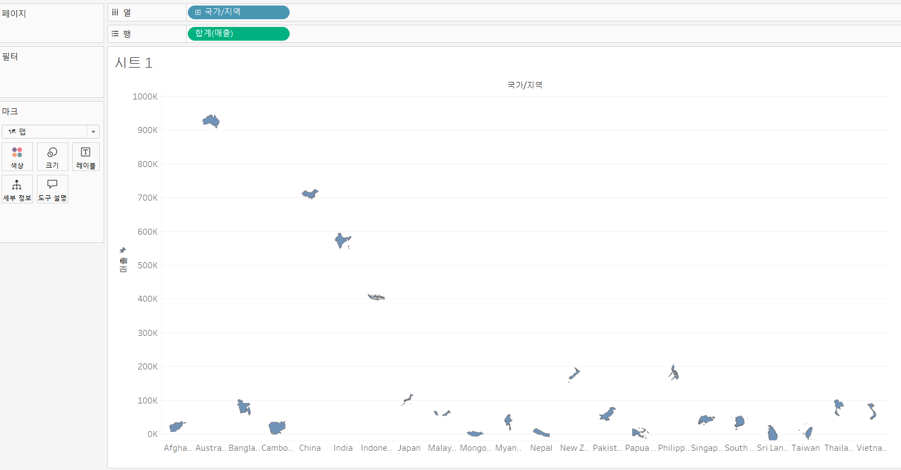
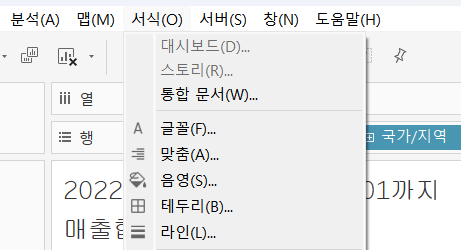
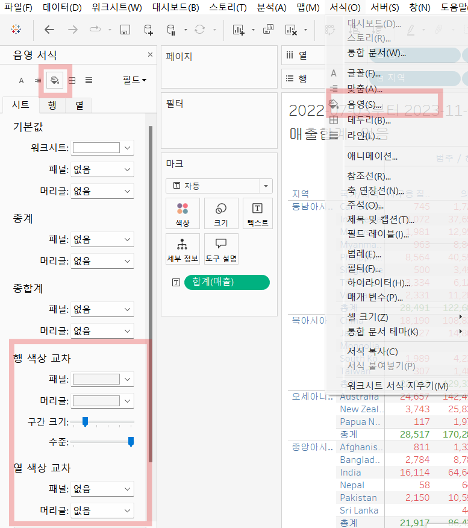
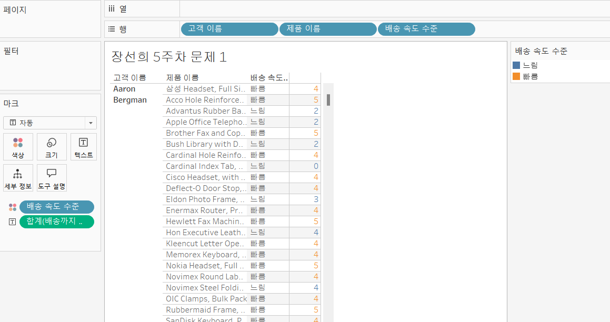

# Fifth Study Week

- 39강: [LOD](#39강-lod)

- 40강: [EXCLUDE](#40-lod-exclude)

- 41강: [INCLUDE](#41-lod-include)

- 42강 : [매개변수](#42-매개변수)

- 43강 : [매개변수 실습](#43-매개변수-실습) 


- 44강: [매개변수 실습](#44-매개변수-실습)

- 45강: [마크카드](#45-워크시트-마크카드)

- 46강: [서식계층](#46-서식-계층)

- 47강: [워크시트](#47-워크시트-서식)

- [문제1](#문제-1)

- [문제2](#문제-2)

## Study Schedule

| 강의 범위     | 강의 이수 여부 | 링크                                                                                                        |
|--------------|---------|-----------------------------------------------------------------------------------------------------------|
| 1~9강        |  ✅      | [링크](https://www.youtube.com/watch?v=AXkaUrJs-Ko&list=PL87tgIIryGsa5vdz6MsaOEF8PK-YqK3fz&index=84)       |
| 10~19강      | ✅      | [링크](https://www.youtube.com/watch?v=AXkaUrJs-Ko&list=PL87tgIIryGsa5vdz6MsaOEF8PK-YqK3fz&index=75)       |
| 20~29강      | ✅      | [링크](https://www.youtube.com/watch?v=AXkaUrJs-Ko&list=PL87tgIIryGsa5vdz6MsaOEF8PK-YqK3fz&index=65)       |
| 30~38강      | ✅      | [링크](https://www.youtube.com/watch?v=e6J0Ljd6h44&list=PL87tgIIryGsa5vdz6MsaOEF8PK-YqK3fz&index=55)       |
| 39~47강      | ✅      | [링크](https://www.youtube.com/watch?v=AXkaUrJs-Ko&list=PL87tgIIryGsa5vdz6MsaOEF8PK-YqK3fz&index=45)       |
| 48~59강      | 🍽️      | [링크](https://www.youtube.com/watch?v=AXkaUrJs-Ko&list=PL87tgIIryGsa5vdz6MsaOEF8PK-YqK3fz&index=35)       |
| 60~69강      | 🍽️      | [링크](https://www.youtube.com/watch?v=AXkaUrJs-Ko&list=PL87tgIIryGsa5vdz6MsaOEF8PK-YqK3fz&index=25)       |
| 70~79강      | 🍽️      | [링크](https://www.youtube.com/watch?v=AXkaUrJs-Ko&list=PL87tgIIryGsa5vdz6MsaOEF8PK-YqK3fz&index=15)       |
| 80~89강      | 🍽️      | [링크](https://www.youtube.com/watch?v=AXkaUrJs-Ko&list=PL87tgIIryGsa5vdz6MsaOEF8PK-YqK3fz&index=5)        |


<!-- 여기까진 그대로 둬 주세요-->

> **🧞‍♀️ 오늘의 스터디는 지니와 함께합니다.**


## 39강. LOD
**LOD : Level Of Detail; 뷰의 세부수준**

ㄴ> 현재의 뷰에는 영향을 받지 않고, 계산할 수준을 세부적으로 제어 가능

### ✅[FIXED]
: 현재 뷰와 상관없이 원하는 차원에서 계산 가능

1) FIXED에서 설정한 차원이 뷰에 포함되어있을 때 

    - 현재 뷰 : 각 지역의 국가별 매출

    
    
    - fixed함수로 계산된 필드 만들어서 지역별 매출 표시 가능(중괄호 활용)
    - 계산식 작성 시 여러 개의 차원을 기준으로 할 때, 각 차원들을(,)로 구분

   
    .png)
    
    - 국가/지역별 매출이아니라 FIXED에 설정한 [지역]의 값으로 세부값 표시

2) FIXED에서 설정한 차원이 뷰에 포함되어있지 않을 때,

.png>)

- LOD표현식에서 차원을 입력하지 않으면 전체 데이터 기반으로 계산
- 전체 데이터를 기반으로 구성비율 계산할 수 있음

## 40. LOD EXCLUDE
**: *현재 뷰*에서 특정 차원을 제외하여 계산할 때 사용**


지금 화면은 하위 범주별 매출이 나와있음.

하지만 범주별 매출이 보고싶다면 FIXED 혹은 EXLUDE를 사용해야함

- FIXED 계산식


- EXCLUDE 계산식

    - 하위범주를 'EXCLUDE' 하지만 '제조업체' 차원이 하위범주보다 세부수준이 낮아서 제조업체를 기준으로 값을 표시함.
<!-- INCLUDE, EXCLUDE, FIXED 등 본 강의에서 알게 된 LOD 표현식에 대해 알게 된 점을 적고, 아래 두 질문에 답해보세요 :) -->

> **🧞‍♀️ FIXED와 EXCLUDE을 사용하는 경우의 차이가 무엇인가요?**

```
*FIXED: 현재 뷰와 상관없이 특정 차원만을 사용해서 값을 계산 -> 필터의 영향 X
=> 고정된 차원의 값

*EXCLUDE: 뷰의 차원을 따라 계산하기 때문에 FILTER나 세부수준에 따라 값이 달라진다
```

**악세사리를 기준으로 다른 제품들의 매출을 비교해보자**


1. 악세사리의 매출을 계산하는 필드 생성


2. 더블클릭하면 악세사리의 매출값만 표시됨


3. 제품마다 "액세서리"의 매출값을 표시하는 필드를 만들기 위해서 계산된 필드 생성

: 해당 함수가 하위 범주 차원을 무시하고 액세서리의 매출 값만 반환

4. 적용


5. 각 제품별 매출과 악세사리의 매출의 차이를 나타내는 필드 생성

**[적용 +  CTRL해서 색상에 드래그&드랍한 모습]**

->모든 제품들의 매출이 악세사리 매출을 기준으로 얼마나 차이가 나는지 한 눈으로 확인 가능

(파란색: 악세사리보다 높은 매출/주황색: 악세사리보다 낮은 매출)


> **🧞‍♀️ 왜 ATTR 함수를 
사용하나요?**

```
해당 값이 단일값인지 확인하기 위해서
단일 값이면 그 값을 반환하고, 그렇지 않으면 *나 NULL을 반환한다.
```


## 41. LOD INCLUDE
**: 현재 뷰에서 특정 차원을 추가해서 계산하는 방삭**

- 차원 필터에 따라 값이 변경함

**✅각 도시의 고객당 평균 매출**


- 총계를 분석탭을 활용해서 만든것이기 때문에, 이를 재사용하기 위해서 계산식으로 만들어줄 것임 => INCLUDE LOD 표현식 사용

```
AVG( ({ INCLUDE [주문 Id] : SUM([매출])})

: 주문 ID차원을 포함해서 합계한 매출의 평균을 반환하겠다

AVG({FIXED[주문 Id]:SUM([매출])}) 

와 동일한 값 출력
```


> **🧞‍♀️ 그렇다면 어떤 경우에 각 표현식을 사용하나요? 예시와 함께 적어보아요**


```
✅FIXED LOD
차원과 측정값 모두 반환
-> 뷰에 표시되는 값이 차원이면 FIXED LOD 표현식만 사용할 수 있음.
- '필터와 관계없이' 고정된 차원의 수준에서 데이터를 집계

✅INCLUDE/EXCLUDE LOD
- 측정값만 반환
- 차원필터의 영향을 받음
```
**🫧예시
[FIXED LOD]**

EX) 국가별 전체 매출 총합을 계산하고, 이후 지역별로 매출을 분석하고 싶을 때.

`FIXED [Country] : SUM([Sales])`

- 이후 지역이나 제품에 대해서 필터를 걸더라도 국가 전체의 매출 총합은 변하지 않음
- 국가별 평균 매출을 보싶을 때, 국가 전체 매출과 비교해서 특정 지역의 매출을 비교할 수 있음.

**🫧예시
[INCLUDE LOD]**

: 기존의 집계 차원에 추가적인 차원을 포함해 집계를 생성할 때 사용

EX) 각 지역내의 고객별 평균 매출을 계산하고 싶을 때,

`INCLUDE [고객 ID] : AVG([Sales])`

- 지역별 고객의 매출 기여도를 파악하거나 고객 세그먼트별 매출 차이를 분석할 때 유용

- 특정 지역 내 고객 간 매출 차이가 큰 경우 세분화 전략을 세울 때 활용 가능

**🫧예시
[EXCLUDE LOD]**

: 특정 차원을 제외하고 집계를 수행하고 싶을 때

EX) 월별 매출 데이터를 표시하면서, 각 월과 관계없는 연간 평균 매출을 함께 표현하고 싶을 때

`EXCLUDE [Month] : AVG([Sales])`

을 활용해서 연간평균매출 계산식 생성

- 월별 매출이 연간 평균보다 높은지 또는 낮은지를 시각화해 계절적 추세를 분석할 수 있습니다.

---

## 42. 매개변수

**❓매개변수를 활용하는 이유**

ex) 매출 상위 10개의 범주를 확인했는데, 이번에는 상위5개를 보고싶어, 다음번에는 또 7개를 봐. 이런경우의 번거로운 과정을 최소화하기 위해서 활용

- 매개변수는 반드시 계산식, 필터, 참조선과 함께 사용된다.

### 매개변수 만드는 방법
**필터활용**


**우클릭활용**


**데이터 패널 활용**


### 데이터 패널의 매개변수를 활용해보기

1. 아래 부분 설정후 매개변수 우클릭 > 매개변수 표시하기


2. 표시를 눌러도 적용되지 않는 경우, **계산식, 필터, 참조선**중 활성화되지 않은 것이 있는지 확인


> **🧞‍♀️ 집합에도 매개변수를 적용할 수 있나요? 시도해봅시다**


## 43. 매개변수 실습

### 차원에 대한 매개변수 바꾸기


❗매개변수는 단독으로 활성화될 수 없기 때문에 이를 활성화하기 위한 계산식 필요 


### 매개변수에 따라 시트의 제목도 함께 변경하기


### 측정값을 활용한 매개변수


❗매개변수는 단독으로 활성화될 수 없기 때문에 이를 활성화하기 위한 계산식 필요 
- 계산식 설정 후 열에 드래그&드랍

### 측정값에 따른 단위설정


- 측정값 선택 매개변수 복제 후 이름과 연결되는 계산된 필드 생성
- 레이블 설정

## 44. 매개변수 실습

**🫧EX) 목표 매출을 달성한 국가와 달성하지 못한 국가들을 색상으로 구분하는 방법**

**STEP 1**

 참조선을 워크시트로 드래그 > 값에서 매개변수 만들기 클릭


**STEP 2**

매개 변수 만들기


**STEP 3**

계산식 필드 만들기

`IF SUM([매출]) >= [목표매출]
then    "목표 달성"
ELSE    "목표 미달성"
END`

**STEP 4**

결과출력


---

**🫧EX) 시작날짜와 마지막 날짜에 대한 매개변수 생성**

**STEP1**


복제해서 마지막 날짜 매개변수도 생성

**STEP2**


**STEP3**

설정된 기간동안의 매출을 확인할 수 있는 계산식 생성 후 마크카드의 세부정보로 DRAG&DROP


**STEP4** 

구간과 매출에 따라 제목 생성


**결과** 


---

## 45. 워크시트 마크카드

<!-- 마크카드에 대해 알게 된 점을 적어주세요 -->
디자인의 **직관성**이 중요
### 마크
:워크시트안에 있는 데이터들

- 마크의 서식을 변경하기 위해서 마크카드를 활용

**🫧활용방법 1.**

**드롭다운에서 마크 유형 변경 :**




- 차트의 유형은 변경하지 않고 마크 자체만 변경
- 막대차트를 유지하면서 각 막대의 맨 위에 국가의 모양이 표시됨

**🫧활용방법 2.**

**마크카드 색상 활용**

- 마크색상, 투명도, 테두리 활용 가능
- "색상"의 후광옵션은 맵 차트에서만 사용 가능(그저 디자인적 요소)
- 필드를 색상마크에 DRAG&DROP하면 각 필드들이 마크들이 색상으로 구분됨
    - 연속형: 색상 범위 범례가 나타남
    - 불연속형: 항목별 범례가 나타나서 관련 색상을 사용자가 직접 지정 ㄱㄴ

**🫧활용방법 3.**

**마크카드 레이블 활용**

- 레이블의 서식을 설정해서 해당 레이블이 어떤 레이블인지 한눈에 표시할 수 있음.

**🫧활용방법 4.**

**마크카드 세부정보 활용**

- 해당차트에서 데이터를 구분해 표시
- 연속형 필드를 사용하면 도구 설명에 데이터가 추가됨(차트의 모양은 변하지않고 마우스 오버해서 확인할 수 있음)

**🫧활용방법 5.**

**마크카드 도구설명 활용**

- 마우스 오버했을 때 보이는 정보란에 대한 서식을 설정 가능


**+차트 유형에 따른 6번째 서식 옵션**

- EX) 라인 차트의 경우 라인유형을 다른 것으로 바꿀 수 있음

## 46. 서식 계층


> **🧞‍♀️ 서식계층을 일반적인 것에서 구체적인 것 순서로 기입해보세요**


구체적인 것에서 서식을 변경하게 되면, 구체적인 계층에 설정한 서식이 적용됨

**⚪ 통합문서 내에 일괄적으로 글꼴을 적용하고 싶은 경우**

: 서식 > 통합문서에서 한번에 적용 가능



**1. 워크시트 & 행/열 서식**


서식 계층 : 워크 시트 > 행/열

행 서식은 워크시트보다 하위계층이기 때문에 워크시트 서식 위에 덧씌운다고 생각하면 될듯.

❗워크시트의 변경사항이 하위계층에 반영되지 않음

**2. 특정 필드 서식**
1) 서식 패널 상단의 "필드"에서 서식을 변경할 필드를 선택

2) 뷰에서 우클릭해서 서식 설정

3) 마크카드에서 텍스트 설정


**➕이전에 설정한 서식들을 전부 지우고 싶은 경우, 서식 > "워크시트 서식 지우기" 선택**

**❗마크카드에서 설정한 서식 이전에 설정한 서식들이 전부 지워짐**


## 47. 워크시트 서식(서식TABL-글꼴,맞춤,음영)

**⚪ 서식TAB-글꼴**


- 워크시트 내에 표시되어있는 텍스트에 글꼴, 색상 그리고 크기를 설정할 수 있음.

**⚪ 서식TAB-맞춤**


**⚪ 서식TAB-음영/서식패널**



- 워크 시트 내 표시된 데이터 셀에 음영을 적용함
- 행/열 색상 교차 기능을 통해 데이터 셀의 구간을 설정해 음영을 설정가능

- 행 색상교차의 구간 크기에서 하나의 눈금 : 데이터 셀의 단위

=> 맨 왼쪽으로 끌어다놨을 때 음영이 0이라는것을 의미하기 때문에 전부 사라짐


## 문제 리스트


## 문제 1.

```
가장 많이 주문한 사람들은 물건 배송을 빨리 받았을까요?
조건을 준수하여 아래 이미지를 만들어봆시다.
1) 국가/지역별(이하 '나라'로 통칭), 범주별로 배송일자가 다를 수 있으니 먼저, 나라별/범주별로 평균 배송일자를 설정한 뒤,
2) 각 나라에서 가장 많이 주문한 사람의 이름을 첫 번째 열,
3) 그 사람이 주문한 제품 이름을 2번째 열,
4) 각 상품이 배송까지 걸린 날 수를 표현하고
5) 그리고 만약 배송이 각 나라/범주별 평균보다 빨랐다면 '빠름', 같다면 '평균', 느리다면 '느림' 으로 print 해주세요. 
```

### 문제 1번 풀이과정

**STEP1 배송까지 걸린 일수 계산식 만들기**
```
DATEDIFF('day',[주문 날짜],[배송 날짜])
```

**STEP2. 나라/범주별 배송까지 걸린 일수 평균 필드 만들기**
```
{FIXED[국가/지역],[범주] : AVG([배송까지 걸린 일수])}
```

**STEP3. 배송 속도 수준 계산된 필드 만들기**

```
IF [배송까지 걸린 일수] >= [나라별/범주별 평균 배송기간] THEN "빠름"
ELSEIF  [배송까지 걸린 일수] = [나라별/범주별 평균 배송기간] THEN "평균"
ELSE "느림"
END
```

**STEP4. 행, 열 설정**



```
❓궁금한 점
각 나라에서 가장 많이 주문한 사람의 이름을 첫 번째 열에서 어떻게 표현..?

1) {FIXED [국가/지역],[고객 이름] : COUNT([주문 Id])}

2) {INCLUDE [국가/지역], [고객 이름] : COUNT([주문 Id])}
```


## 문제 2.

```
채원이는 태블로를 쓰실 수 없는 상사분께 보고하기 위한 대시보드를 만들고 싶어요. 

제품 중분류별로 구분하되 매개변수로써 수익, 매출, 수량을 입력하면 저절로 각각 지표에 해당하는 그래프로 바뀌도록 설계하고자 해요.

 어떤 값이 각 지표의 평균보다 낮은 값을 갖고 있다면 색깔을 주황색으로, 그것보다 높다면 파란색으로 표시하고 싶어요. 그 평균값은 각 지표별로 달라야 해요.
```
### 풀이 과정

**⚪1. 매개변수 설정**


**⚪2. 측정값 case 활성화를 위한 계산식 추가**


**⚪3. 측정값 평균에 대한 계산식 추가**


❓왜 avg는 안되징..

**⚪4. 색깔 구분을 위한 비교 계산식 추가**


❓아직 집계에 대한 이해가 부족한 듯,,,

**⚪5. 뷰 구현**

- 열: 측정값 case
- 행: 하위범주(내림차순 정렬)
- 마크카드 색상: 평균보다 낮은가? -> 범주별 색상 설정