# Sixth Study Week


## Study Schedule
<br>

| 회차 | 강의 범위   | 강의 이수 여부 | 링크                                                                                                     |
|------|-------------|----------------|--------------------------------------------------------------------------------------------------------|
| 1    | 1~7강       | ✅              | [링크](https://www.youtube.com/watch?v=AXkaUrJs-Ko&list=PL87tgIIryGsa5vdz6MsaOEF8PK-YqK3fz&index=84)    |
| 2    | 8~17강      | ✅              | [링크](https://www.youtube.com/watch?v=AXkaUrJs-Ko&list=PL87tgIIryGsa5vdz6MsaOEF8PK-YqK3fz&index=75)    |
| 3    | 18~27강     | ✅              | [링크](https://www.youtube.com/watch?v=AXkaUrJs-Ko&list=PL87tgIIryGsa5vdz6MsaOEF8PK-YqK3fz&index=65)    |
| 4    | 28~37강     | ✅              | [링크](https://www.youtube.com/watch?v=e6J0Ljd6h44&list=PL87tgIIryGsa5vdz6MsaOEF8PK-YqK3fz&index=55)    |
| 5    | 38~47강     | ✅              | [링크](https://www.youtube.com/watch?v=AXkaUrJs-Ko&list=PL87tgIIryGsa5vdz6MsaOEF8PK-YqK3fz&index=45)    |
| 6    | 48~57강     | ✅              | [링크](https://www.youtube.com/watch?v=AXkaUrJs-Ko&list=PL87tgIIryGsa5vdz6MsaOEF8PK-YqK3fz&index=35)    |
| 7    | 58~67강     | 🍽️             | [링크](https://www.youtube.com/watch?v=AXkaUrJs-Ko&list=PL87tgIIryGsa5vdz6MsaOEF8PK-YqK3fz&index=25)    |
| 8    | 68~77강     | 🍽️             | [링크](https://www.youtube.com/watch?v=AXkaUrJs-Ko&list=PL87tgIIryGsa5vdz6MsaOEF8PK-YqK3fz&index=15)    |
| 9    | 78~85강     | 🍽️             | [링크](https://www.youtube.com/watch?v=AXkaUrJs-Ko&list=PL87tgIIryGsa5vdz6MsaOEF8PK-YqK3fz&index=5)     |
---

<br/>
<!-- 여기까진 그대로 둬 주세요-->

> **🧞‍♀️ 오늘은 강의보다 실습과 대시보드 직접 만들기가 더 중요하니, 기록보다는 사고하며 강의를 들어주세요.**

## 48. 워크시트 서식(2)
<!-- 워크시트에 관해 본 강의에서 알게 된 점을 적어주세요 -->


**테두리**

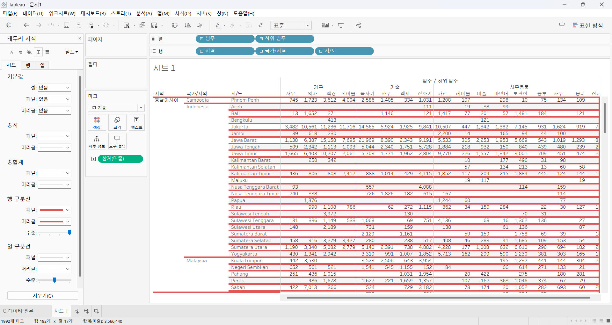


**라인**

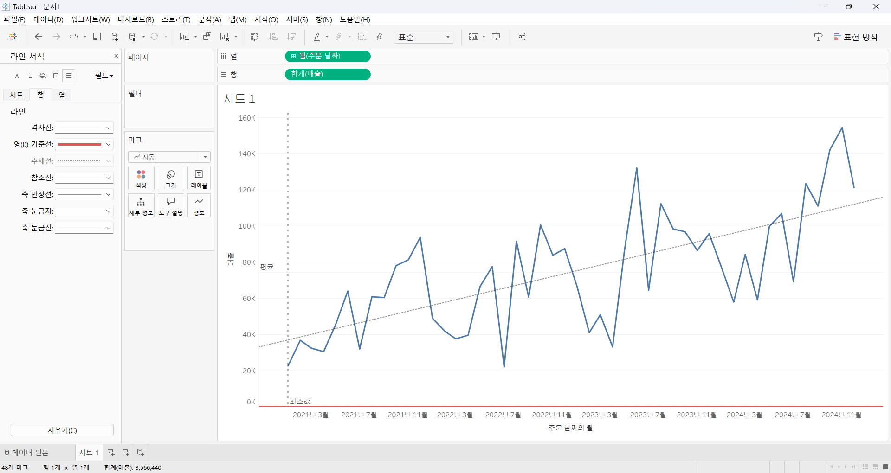


- 테두리와 라인은 데이터를 기준으로 구분
- 테두리 서식 : 뷰에서 테이블, 패널, 셀 및, 머리글을 둘러싸는 라인의 서식을 설정,
- 라인서식은 뷰에서 표시된 데이터 축에 대한 모양을 설정


## 49강. 대시보드패널

<!-- 대시보드패널 강의에서 알게 된 점을 적어주세요. -->

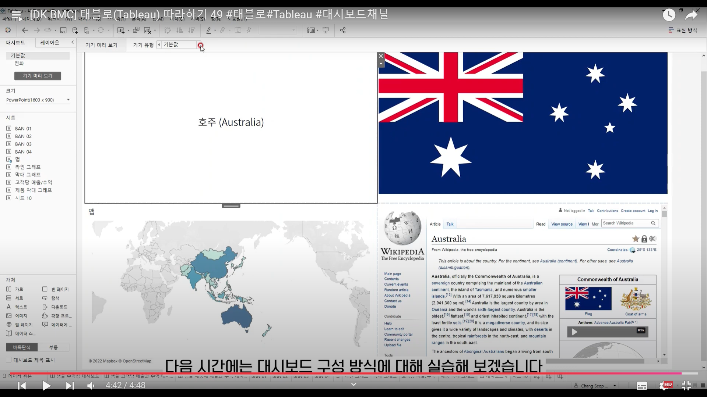

워크시트를 기반으로 구성할 수 있고, 이미지, 웹사이트, 텍스트등을 첨부할 수 있음.

## 50. 대시보드 구성방식

<!-- 알게 된 점을 적고, 아래 질문에 답해보세요 :) -->

> **🧞‍♀️ 부동과 바둑판식 방식을 차이를 중점으로 기술해보세요**
```
⚫바둑판 
: 개체 추가시, 격자무늬 구조의 특정위치에만 개체들을 구성할 수 있음.

-> 개체 추가 시, 다른 개체들의 크기에 영향을 줌

⚫부동 
: 개체를 자유롭게 배치할 수 있으며, 사용자가 원하는대로 개체를 drag & drop 할 수 있음.

-> 개체 추가시, 다른 개체의 크기나 모양에 영향을 주지 않음.

Shift + drag&drop -> 부동식으로 추가 
```
```
❗TIP❗

<대시보드의 크기가 자주 바뀐다면>, 

"바둑판"을 추천.

- 대시보드의 크기가 비율에 따라 유사한 형식을 유지하기 때문.

---------------------------

<대시보드의 크기가 자주 변경되지 않고, 그래프 내에 빈 공간이 많은 경우>, 

"부동 개체" 를 사용해 빈공간을 채울 수 있음.
```

## 51. 대시보드 컨테이너
**✅ 컨테이너**

**대시보드 개체들과 워크시트들을 그룹화하고 구성할 수 있는 공간**

1) 가로 

    : 내부의 개체들을 ***수평 공간***으로 배열할 때 사용

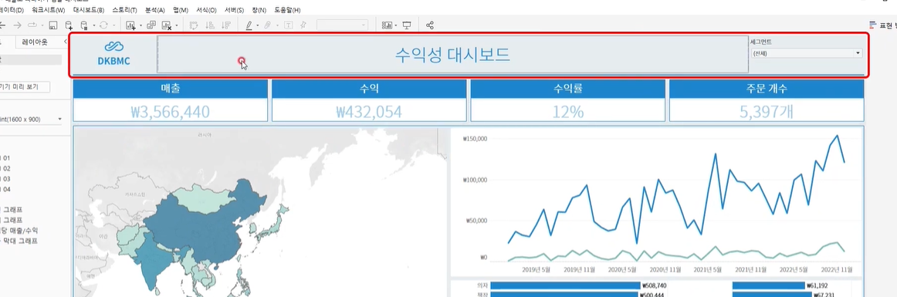


개체가 서로 수평적으로 위치해있으므로, 가로 컨테이너 사용.

2) 세로
    : 내부의 개체들을 ***수직 공간***으로 배열할 때 사용

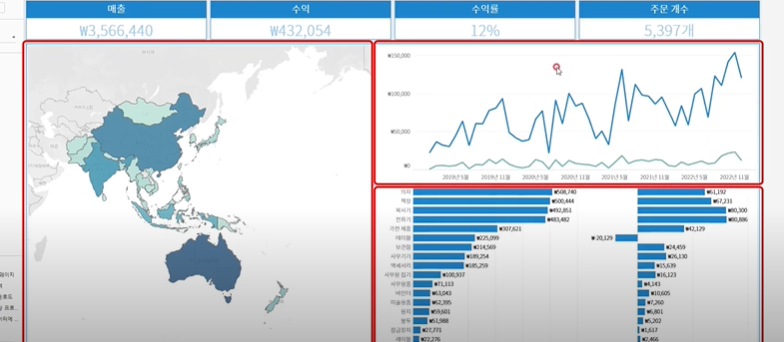

라인그래프와 막대그래프는 서로 수직적으로 배치 => 세로 컨테이너 활용


✅ 컨테이너가 제대로 배치되었는지 확인하기 위해서는 '레이아웃'탭에서 "항목 계층"항목에서 확인 가능

✅ 컨테이너의 '높이 편집' 옵션에서 배너의 사이즈 변경 가능,
   - 드롭다운 메뉴에 나타나지 않으면, 처음에 배치한 세로 컨테이너가 없거나, 가로 컨테이너가 세로 컨테이너 내에 배치되지 않은 것 

## 52. 레이아웃 패널

대시보드의 디자인을 변경할 경우, 몇 가지 인터페이스를 통해 변경할 수 있음.

그 중 하나 : 레이아웃 탭
- 대시보드의 개체 속성을 변경할 수 있음.
- 그래프 클릭 > 레이아웃 tab > 옵션 변경
```
✅ 옵션 설명

* 그래프의 제목은 워크시트의 제목으로 기본 설정 -> 숨김가능

* 개체를 부동 개체로 변경 가능. 
(하지만 부동옵션 해제시, 제자리로 돌아가지 않음.)

* 위치&크기 옵션
: 개체의 위치와 크기를 픽셀단위로 변경가능(부동 개체만 가능)

* 여백 옵션
: 배경 색상을 대시보드 모두에 지정하고 싶을 때,

* 바깥쪽 여백
: 선택된 개체의 모서리와 컨테이너의 테두리 사이의 공간을 변경할 수 있음

* 항목 계층
: 대시보드에 있는 컨테이너와 개체를 볼 수 있음.

```


## 53. 필터 동작

<!-- 필터 동작에 대해 알게 된 점을 적어주세요 -->

차트 클릭 > 드롭다운 메뉴에서 '필터' 선택

❗'국가 선택'과 같이 선택 옵션이 많은 경우에는, 대시보드 동작을 사용하는 것이 더 직관적일 수 있음.

### 대시보드 동작

: 사용자는 대시보드의 차트와 직접 상호작용할 수 있음.

1. 대시보드 tab > '동작'

    : 통합 문서에 있는 대시보드 동작을 확인할 수 있음.

**워크시트와 연계되지 않은 경우**

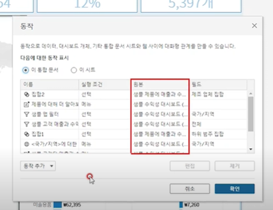

2. 이 시트 옵션 선택 > 원하는 동작 추가

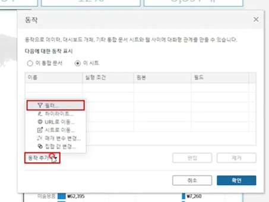

3. 필터 동작을 추가할 시트 설정 & 실행 조건 확인

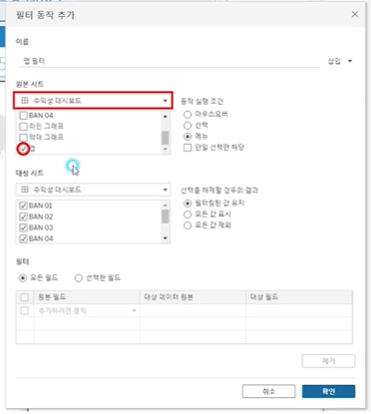

4. 동작 실행시, 변경할 워크시트 선정

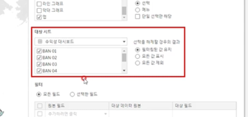

 
번외) 다른 방법

1. 차트를 선택 > "필터로 사용" 기호 선택 > 대시보드 동작 리스트에 동작 추가됨.

2. 해당 동작의 편집화면에서 위의 방법과 동일하게 편집.

## 54. 대시보드 하이라이터 동작

<!-- 하이라이터에 대해 알게 된 점을 적어주세요 -->

대시보드에서 데이터를 필터링하는 대신, 전체 데이터 중 선택한 조건에 따라 데이터를 하이라이트로 구분하는 것.

.png)

데이터 마크의 양 때문에 원하는 제품의 하위범주를 나머지 데이터와 구별하기 어려움

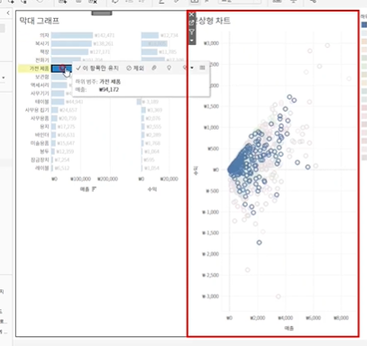

=> 대시보드에서 막대그래프와의 하이라이트 동작 활용!

**대시보드 tab > 동작 > 하이라이트 동작**


❗작동되지 않을 경우,
- 선택 기준으로 사용하는 필드(위에서는 하위범주가 예시)가 변경할 그래프에 포함되어 있어야 함.
- 범주별로 정렬되는것이 싫다면, 적어도 마크의 도구 설명에 데이터를 포함시켜두어야 함.

## 55. 대시보드 URL

<!-- URL에 대해 알게 된 점을 적어주세요 -->
대시보드 동작을 이용해서 사용자가 대시보드와 상호작용해, 웹사이트로 이동할 수 있는 기능을 추가할 수 있음.

1. 대시보드tab>동작 추가 中 'url로 이동' 설정

2. 해당 기능을 추가할 시트 설정

3. url입력

**주의사항**


- 보라색 부분에 url을 입력할 경우에는, 어떤 나라를 클릭하던 해당 url이 표시됨
- '삽입'버튼을 클릭해 국가/지역 클릭 
`~~wiki/<국가/지역>`

**완성된 설정 화면**


- 메뉴창에 표시될 텍스트를 설정하는 것이기 때문에 '삽입' 버튼에서 <국가/지역> 을 선택해야함. 

5. 번외) 웹페이지 개체 활용하기 : 웹페이지 개체 추가 > url링크설정 x

6. URL동작 추가

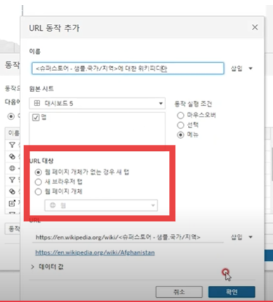

**결과 실행 화면**

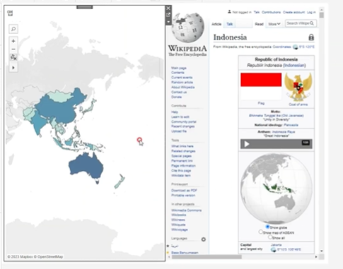


## 56. 대시보드 시트에 이동 동작

1. 대시보드 TAB > 동작추가 > 시트로 이동 동작 추가


2. 이동할 대시보드에 대해서 필터 적용하기

    : 대시보드 > 동작 > 필터

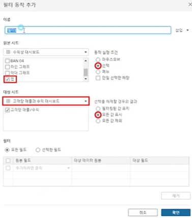

3. 수익성 대시보드로 다시 돌아가는 단추 만들기

    1) 개체 옵션 > "편집 단추" 선택
    2) 이동할 위치에 돌아갈 대시보드 선택 & 이름 설정
    3) 실행방법 : ALT키 + 단축키 클릭 

## 57. 매개변수 변경 동작

1. 매개변수를 적용할 워크시트의 원본에 매개변수가 존재하는지 확인할 것.
2. 필터가 '참'일때 적용이 잘 되고 있는지 확인할 것
3. 대시보드 TAB> 동작 추가 > 매개 변수 변경

**시작하는 날짜 설정**
.png>)


**끝나는 날짜 설정**
.png>)

## 문제

오늘은 별도의 문제가 없습니다. 


여러 대시보드를 참고하시어, superstore 데이터를 사용해 나만의 대시보드를 제작해주세요.

**단, 워크시트 3개 이상의 그래프를 표시해야 하며 각 시트 간 상호작용성 필터 or 하이라이트 동작은 꼭 추가되어야 합니다**

어떤 부분에 가중을 두었는지, 어떤 사용자 편의성을 고려하였는지에 대한 설명이 필요합니다.


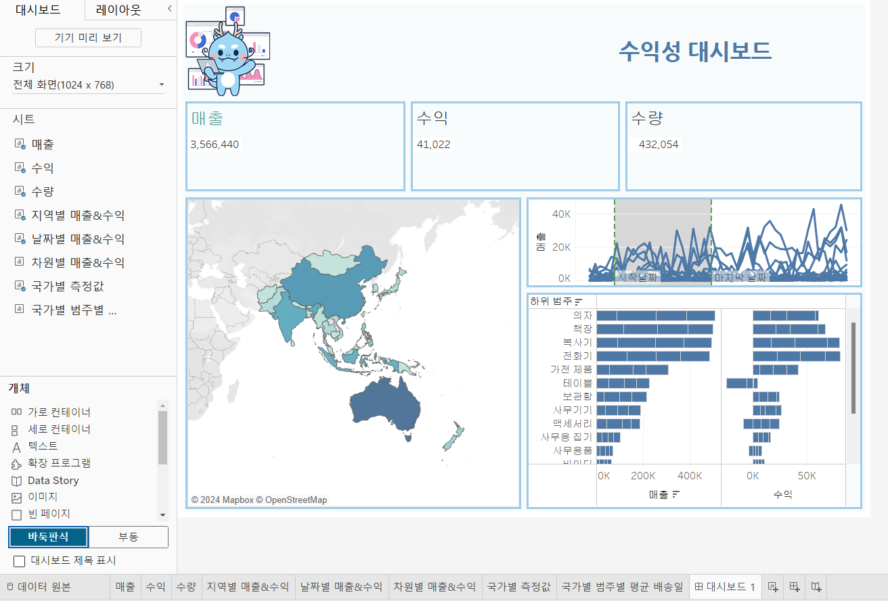

실패에오....

시간을 좀 더 가지고 더 공부해서 다시 해내고 말겠어요
ㅜ.ㅜ!