# 7th Study Week

## Study Schedule
<br>

| 회차 | 강의 범위   | 강의 이수 여부 | 링크                                                                                                     |
|------|-------------|----------------|--------------------------------------------------------------------------------------------------------|
| 1    | 1~7강       | ✅              | [링크](https://www.youtube.com/watch?v=AXkaUrJs-Ko&list=PL87tgIIryGsa5vdz6MsaOEF8PK-YqK3fz&index=84)    |
| 2    | 8~17강      | ✅              | [링크](https://www.youtube.com/watch?v=AXkaUrJs-Ko&list=PL87tgIIryGsa5vdz6MsaOEF8PK-YqK3fz&index=75)    |
| 3    | 18~27강     | ✅              | [링크](https://www.youtube.com/watch?v=AXkaUrJs-Ko&list=PL87tgIIryGsa5vdz6MsaOEF8PK-YqK3fz&index=65)    |
| 4    | 28~37강     | ✅              | [링크](https://www.youtube.com/watch?v=e6J0Ljd6h44&list=PL87tgIIryGsa5vdz6MsaOEF8PK-YqK3fz&index=55)    |
| 5    | 38~47강     | ✅              | [링크](https://www.youtube.com/watch?v=AXkaUrJs-Ko&list=PL87tgIIryGsa5vdz6MsaOEF8PK-YqK3fz&index=45)    |
| 6    | 48~57강     | ✅              | [링크](https://www.youtube.com/watch?v=AXkaUrJs-Ko&list=PL87tgIIryGsa5vdz6MsaOEF8PK-YqK3fz&index=35)    |
| 7    | 58~66강     | ✅             | [링크](https://www.youtube.com/watch?v=AXkaUrJs-Ko&list=PL87tgIIryGsa5vdz6MsaOEF8PK-YqK3fz&index=25)    |
| 8    | 67~77강     | 🍽️             | [링크](https://www.youtube.com/watch?v=AXkaUrJs-Ko&list=PL87tgIIryGsa5vdz6MsaOEF8PK-YqK3fz&index=15)    |
| 9    | 78~85강     | 🍽️             | [링크](https://www.youtube.com/watch?v=AXkaUrJs-Ko&list=PL87tgIIryGsa5vdz6MsaOEF8PK-YqK3fz&index=5)     |
---

<br/>

> **🧞‍♀️ 오늘은 강의보다 실습과 대시보드 직접 만들기가 더 중요하니, 기록보다는 사고하며 강의를 들어주세요.**
> **직접 실습파일을 다운로드하는 번거로움이 있어 assignment > 7th_files에 실습파일을 올려두었습니다. 활용해주세요!**


## 58. 집합값 변경

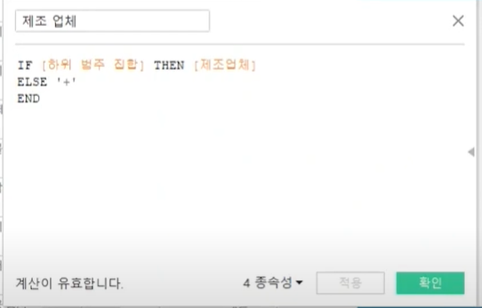

- 하위 범주 집합에 있는 업체인 경우에만 제조업체 표시

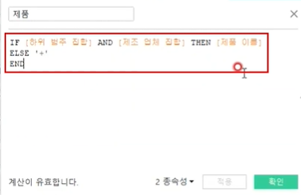

- 제품의 하위범주와 제조 업체가 모두 집합 내에 있는 경우에만 제품이름이 표시됨.

✅**집합값 변경만드는 방법**
1. 대시보드 > 동작 추가 > 집합 동작 추가

2. 변경할 집합을 대상집합에서 선택

3. 동작 실행 결과와 해제시의 결과 모두 선택

✅**두 개의 대시보드를 연결하는 방법**
1. 대시보드 > 동작 추가 > 시트로 이동 동작 설정
2. 원본시트에서 이동할 대시보드의 원본 시트 선택
3. 대상시트에서 이동할 대시보드 선택

✅**다른 대시보드로 이동하는 버튼 만드는 방법**
1. 탐색 개체를 drag&drop
2. 편집버튼 > 이동할 위치 선택
    이름 : 버튼 상에 표시될 제목
3. 실행시 버튼 클릭이 안되면 ***alt+클릭***


## 59강. 스토리패널

스토리 포인트에서 시트 혹은 대시보드의 동작 등의 작업을 실시하고 난 뒤, 스토리 툴 바의 '새 이름으로 저장" 기능을 통해 현재까지 작업을 시작지점으로 지정해서 작업을 저장할 수 있음.


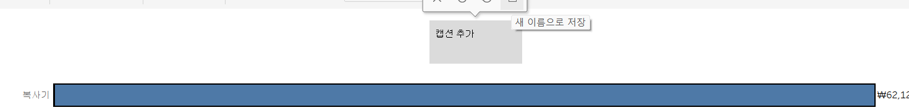

- 하나의 요소를 선택하면, 탐색기에서 "새 이름으로 저장"기능 사용 가능

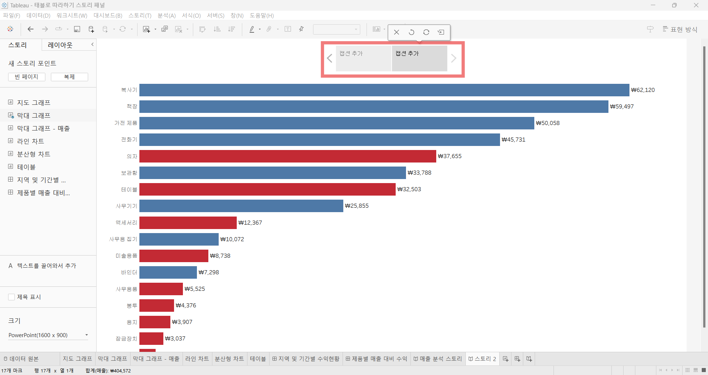

- 탐색기
    - 스토리 포인트를 편집 & 구성
    - 사용자가 탐색기를 이용해 스토리 단계 이동이 가능함
    - 레이아웃 패널에서 스타일 변경 가능.

## 60. 스토리

❓**스토리란 무엇인가?**

생성한 워크시트와 대시보드에 설명을 덧붙여 데이터를 설명하거나 정보를 전달하고, 의사결정에 도움을 주고, 설득력 있는 사례를 구성하는 등의 작업이 가능.

- 막대그래프를 캡션 옆에 DRAG&DROP해서 하나의 캡션을 생성 가능

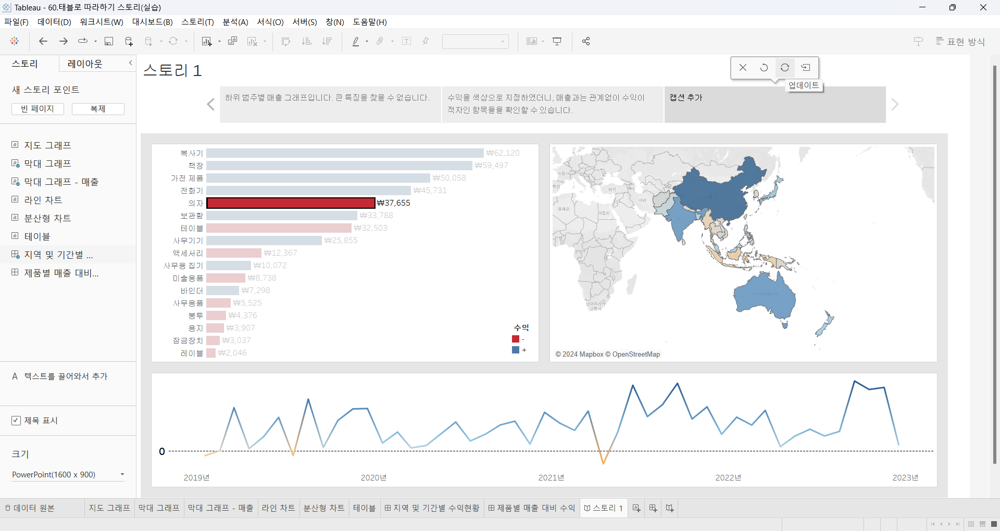

✅**업데이트**

: 업데이트된 시점까지의 작업상태를 나타냄

✅**새이름으로 저장**

생성된 시점의 작업상태를 나타냄

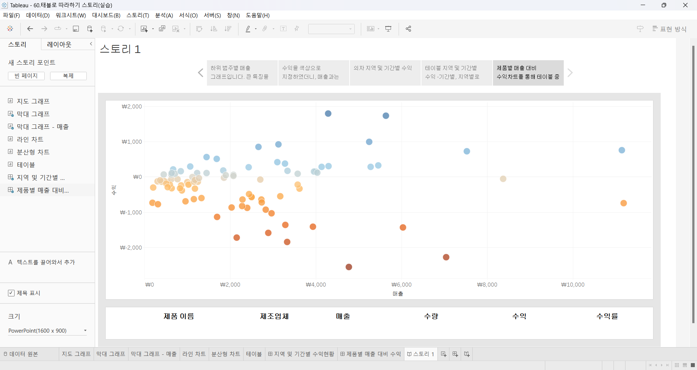

```
👧🏻매출은 문제가 없으나, 수익이 적자가 발생하는 항목을 찾아내고, 그 항목 중 어떤 제품이 문제가 되는지 찾아내어 해결방법을 생각할 수 있는 스토리이다.
```


## 61. 대시보드 탐색

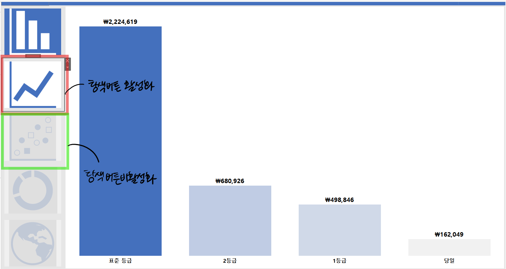

✅**탐색버튼 활성화 방법**
1. 이미지 더블클릭
2. 클릭 시 이동할 대시보드 설정


## 62. 태블로 단추

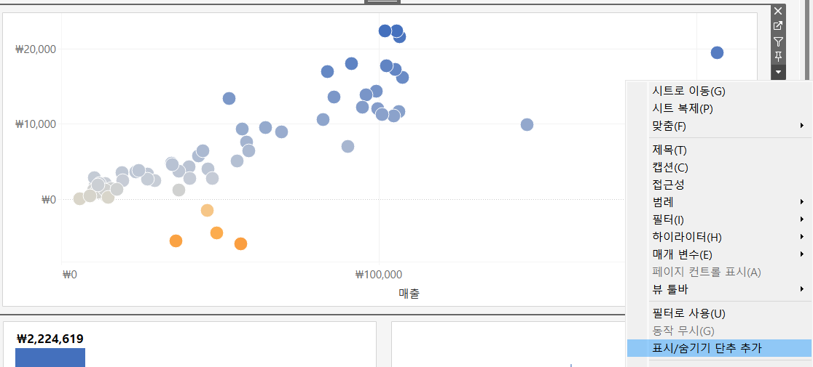

- 표시 숨기기 단추
    - 누르면 워크시트 뿐만 아니라 컨테이너도 3줄 아이콘 형태로 사라짐. 다시 누르면 다시 표시됨.

- 그래프를 숨김으로써, 다른 그래프를 확대해 자세하게 볼 수 있음.

## 63. 막대그래프 드릴다운

❓**드릴 다운**

: 한 요소를 클릭했을 때, 그 요소의 상세 정보가 드러나는 기능 

1. 매개변수 만들기

2. 매개변수에 따른 계산변수 만들기

    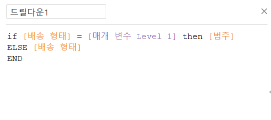


3. 워크시트 툴 > 동작 > 동작추가 > 매개변수변경
    - 매개변수 동작 추가 시, 이름은 명시적인것이 가장 좋음, 


## 64. 트리맵 드릴다운

**목적 : Category - Sub category - Manufacturer 순서로 이루어지는 트리맵 생성**


1. category를 기준으로 집합을 형성
2. 드릴 다운을 실행할 계산식 형성

    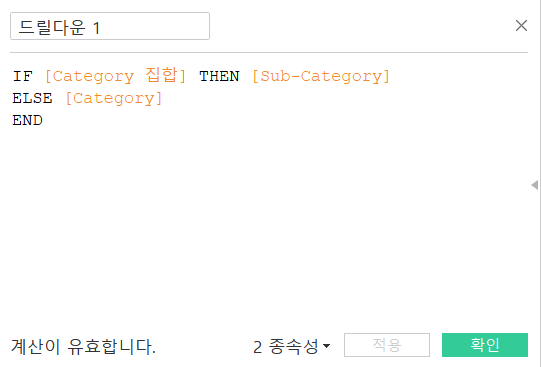

    : category집합일 경우, sub-category로 드릴다운되는 그렇지 않을 경우 category가 되는 if문

3. 해당 계산된 필드를 실행하는데 필요한 동작을 생성

    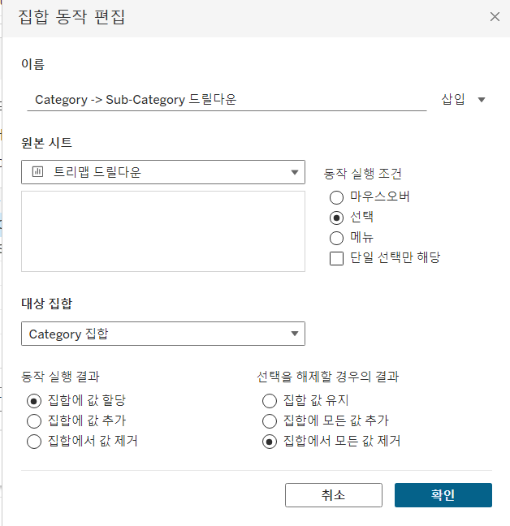

4. 해당 계산식을 마크 창의 레이블로 추가해서 맨 아래에 위치시킴.

    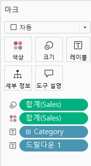

👾👾 1~4번까지의 과정은 category > sub-category로 드릴다운되는 과정.

👾👾 이후부터는 sub-category에서 manufacturere로 드릴되는 과정.

5. 드릴다운 1(계산식)을 우클릭해서 집합을 만듦.

6. 이에 대한 계산식 형성
    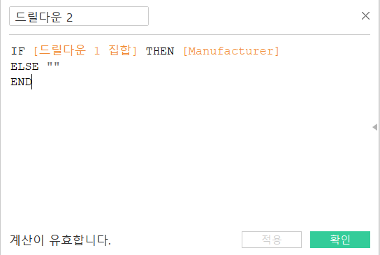
    
    : sub-category집합일 경우, manufacturere로 드릴다운됨, 그렇지 않을 경우 아무것도 출력x

7. 워크시트 > 동작 > 동작 추가 > 집합 값 변경

8. 4번 과정 반복

## 65. 파이 차트 드릴다운

**목표 : Category > Sub-category로 드릴다운되는 파이차트 생성**

1. 카테고리 집합 생성

2. 집합에 따른 계산식 생성

    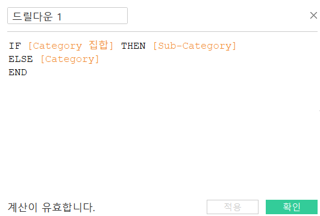

- category집합일 경우 sub-category로 드릴다운되고, 그렇지 않은 경우에는 category를 보여준다는 IF문

3. 워크시트 > 동작 > 동작추가 > 집합값 변경

    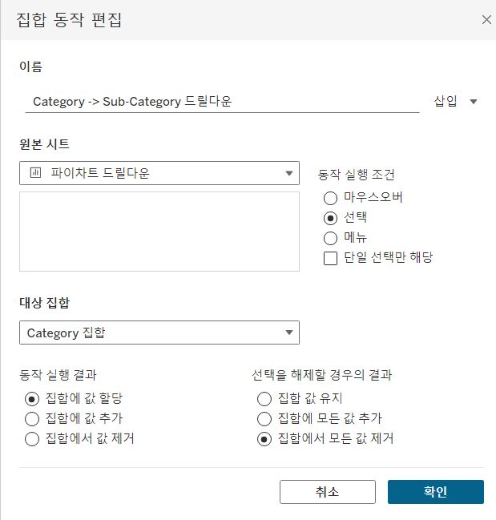


4. 마크창에서의 변경

- 드릴다운1 세부사항에 drag&drop > 세부사항 아이콘에서 색상으로 변경
- category집합 , 드릴다운1을 우클릭해서 정렬 + 색상 마크 클릭 후 테두리 설정해서 가시화 작업

5. 행 더블클릭 후 0 입력해서 임의의 축 생성 후 ctrl 해서 복제

6. 첫번째축에서 드릴다운 1을 제거하고 크기 조정

    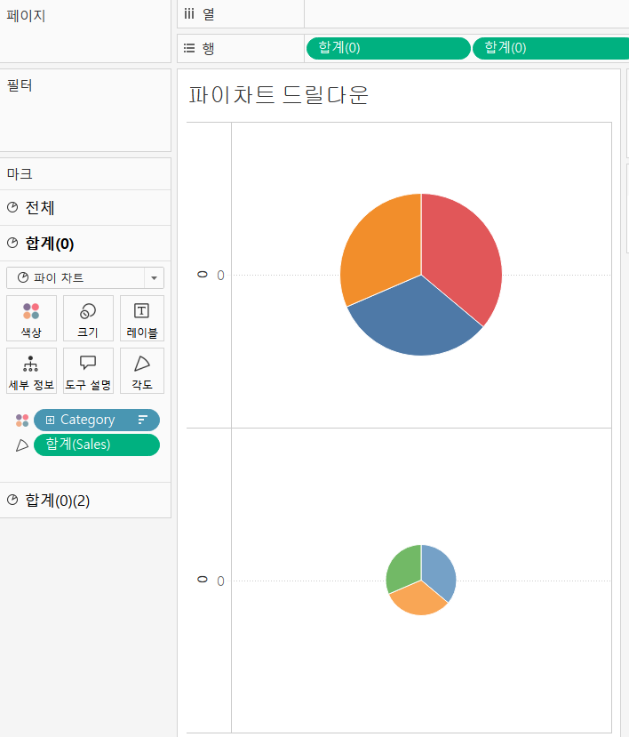

7. 이중축 설정 후 2개의 축 색상 일치하도록 편집

8. 드릴다운 될때만 레이블을 표시하기 위해서 드릴다운 1레이블 계산식 설정

    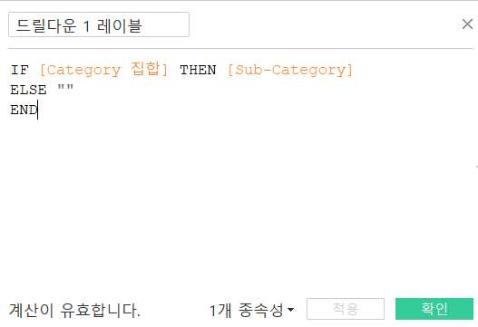

9. 완성!

    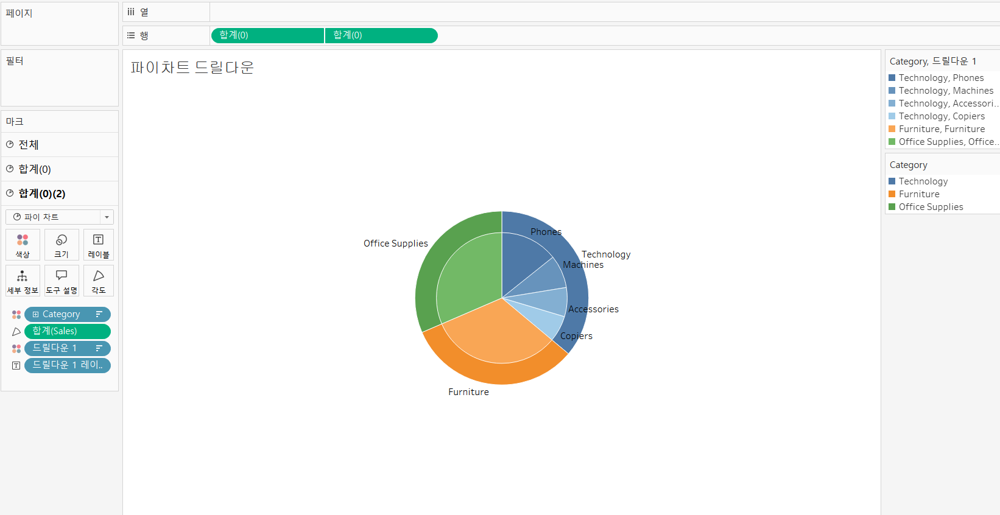


## 66. 지도 드릴다운

**목표 : 국가/지역 > 시/도 순서로 이어지는 드릴다운 생성**

1. [국가/지역] 집합 생성
2. 집합에 따른 계산식 생성
    ```
    IF [국가/지역 집합] then [시/도]
    else [국가/지역]
    END
    ```
3. 계산된 필드를 실행하기 위한 동작 추가 
     
     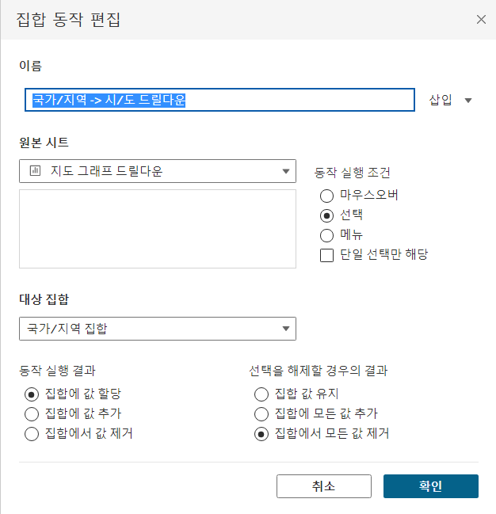
    
+1) 매개변수를 이용해서 드릴다운과 선택한 [국가/지역]만 표시되는 방법

1. 필터링을 위한 매개변수 생성
    
    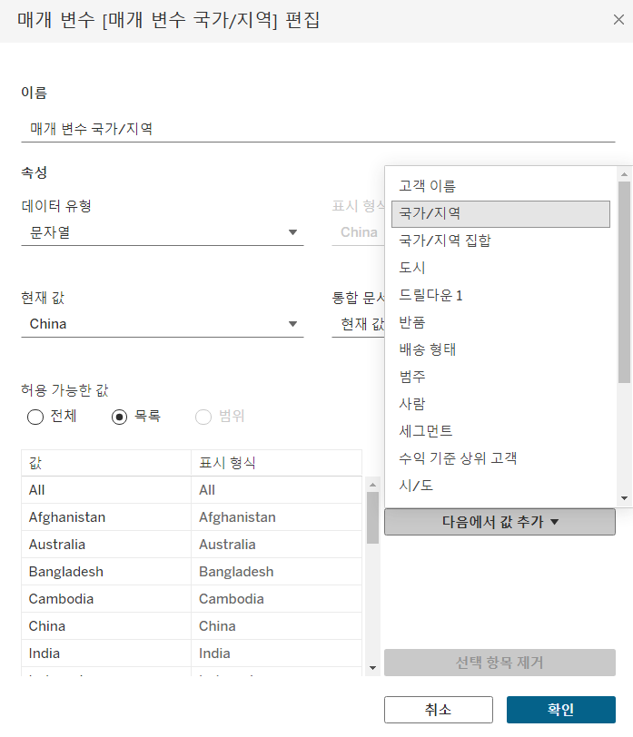


2. 매개변수에 따른 계산된 필드 생성

    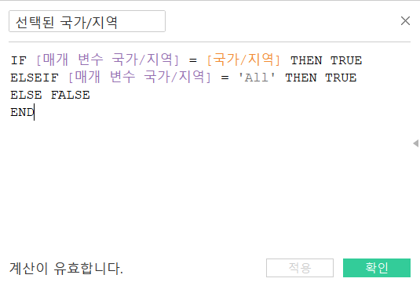

- [매개변수 국가/지역]과 일치하면, [국가/지역]을 출력하고, [매개변수 국가/지역]이 all값일 경우에 true를 출력하고, 그 이외의 경우엔 false를 출력하는 함수식. 

3. 매개변수 표시 & 필터링해서 참 선택


4. 해당 계산식을 실행하기 위한 동작 설정

    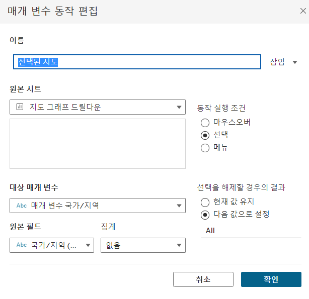

5. 마크 > 도구 설명에서 아래와 같이 설정하면 

    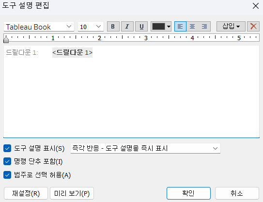

   아래와 같이 드릴다운됨에 따라 시/도의 이름으로 변경됨

   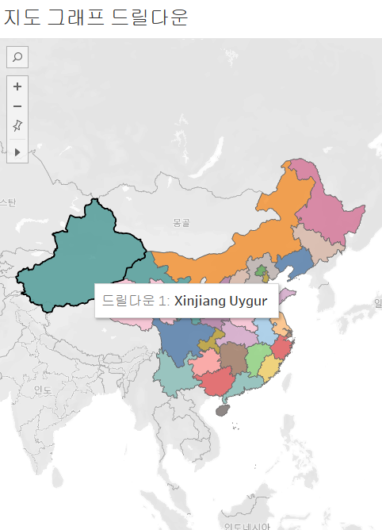 

---

## 문제

오늘은 별도의 문제가 없습니다.

다만, 학술제 이후 마지막 과제(11/27~)로서 한 주 동안에는 학술제 주제 관련 데이터(없을 경우, 본인 관심 데이터)를 사용해 나만의 대시보드를 제작할 예정입니다. 또한, 학술제에서 시각화 시 태블로를 사용하기를 권장하는 안내가 나갈 예정입니다.
그 때 열심히 배운 내용을 잘 활용해주세요. 감사합니다 :)